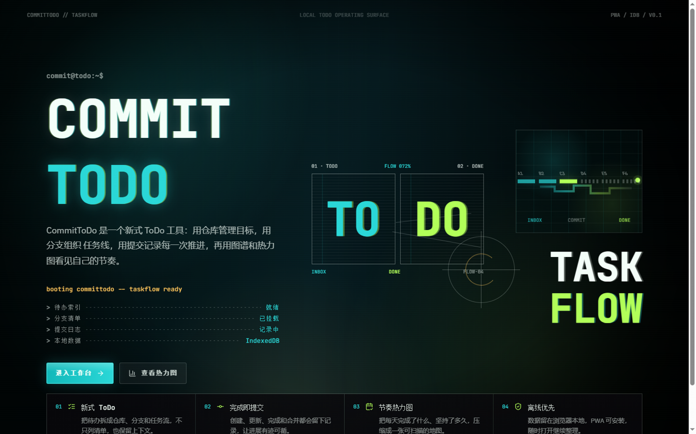
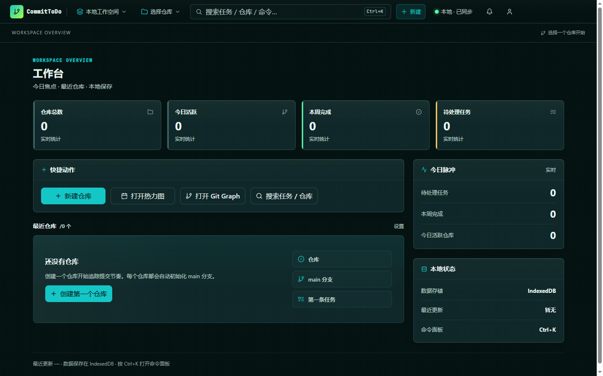

<div align="center">

<pre>
 ██████╗ ██████╗ ███╗   ███╗███╗   ███╗██╗████████╗
██╔════╝██╔═══██╗████╗ ████║████╗ ████║██║╚══██╔══╝
██║     ██║   ██║██╔████╔██║██╔████╔██║██║   ██║
██║     ██║   ██║██║╚██╔╝██║██║╚██╔╝██║██║   ██║
╚██████╗╚██████╔╝██║ ╚═╝ ██║██║ ╚═╝ ██║██║   ██║
 ╚═════╝ ╚═════╝ ╚═╝     ╚═╝╚═╝     ╚═╝╚═╝   ╚═╝
</pre>

### A todo tool that thinks in commits.

<sub><sub>`taskflow ready · indexeddb online · pwa installable · v0.1.0`</sub></sub>

---

<p>
  
  
  
  
  
  
</p>

<p>
  <a href="#-quick-start"><b>Quick Start</b></a>  ·  
  <a href="#-screenshots"><b>Screenshots</b></a>  ·  
  <a href="#-architecture"><b>Architecture</b></a>  ·  
  <a href="#-roadmap"><b>Roadmap</b></a>  ·  
  <a href="#-license"><b>License</b></a>
</p>

</div>

---

> **About this repository** — `Commit` is a cross-platform task management suite. This monorepo currently hosts the main Flutter project (`lib/` · `pubspec.yaml`) and the **`/web`** sub-project that this README documents. The web build is feature-complete and just shipped. Other platform documentation will follow in subsequent releases.
>
> Flutter project conventions live in [`AGENTS.md`](./AGENTS.md) and the most recent audit in [`overview.md`](./overview.md).

---

## 📑 Table of Contents

- [✦ Visual Preview](#-visual-preview)
- [✦ What is CommitToDo?](#-what-is-committodo)
- [✦ Why CommitToDo?](#-why-committodo)
- [✦ Core Capabilities](#-core-capabilities)
- [✦ Feature Matrix](#-feature-matrix)
- [✦ Architecture](#-architecture)
- [✦ Design Language](#-design-language)
- [✦ Built With](#-built-with)
- [✦ Quick Start](#-quick-start)
- [✦ Project Structure](#-project-structure)
- [✦ Data Model](#-data-model)
- [✦ Testing](#-testing)
- [✦ Keyboard Shortcuts](#-keyboard-shortcuts)
- [✦ Roadmap](#-roadmap)
- [✦ Contributing](#-contributing)
- [✦ License](#-license)
- [✦ Acknowledgments](#-acknowledgments)
- [✦ Show Your Support](#-show-your-support)

---

## ✦ Visual Preview

A terminal-grade HUD that actually **boots** — scanlines, typewriter caret, scan-window mask, flow-dot orbit. Not a mockup.

<table>
  <thead>
    <tr>
      <th align="center">▸ Landing · <code>booting committodo -- taskflow ready</code></th>
      <th align="center">▸ Workspace · Linear-grade overview</th>
    </tr>
  </thead>
  <tbody>
    <tr>
      <td align="center"></td>
      <td align="center"></td>
    </tr>
  </tbody>
</table>

> *Both screenshots are unstyled fallbacks served from `web/docs/`. No data was fabricated — empty state reflects a fresh IndexedDB after first install.*

---

## ✦ What is CommitToDo?

**CommitToDo** transplants Git's version-control vocabulary into personal task management:

| Git | CommitToDo |
| --- | --- |
| Repository | a long-term goal / project space |
| Branch | a workstream (theme, phase, iteration) |
| Commit | an immutable progress record (create · update · complete · merge · delete) |
| Graph | a node-edge map of every commit, pan & zoom |
| Heatmap | 365-day cadence visualisation |

Every meaningful action lands a commit. Your progress becomes **replayable, auditable, branch-able** — and 100% lives in your browser via IndexedDB. Offline-first, installable as a PWA, exportable to JSON / CSV / Markdown.

This README documents the **`/web`** build — a React 18 + TypeScript SPA powered by Vite, Dexie, Zustand and `@xyflow/react`.

---

## ✦ Why CommitToDo?

> *Why borrow metaphors from a version-control system for a todo app?*

Most task tools optimise for **capture**. They make adding a task frictionless, then bury you in an unsorted pile the next morning. The result: a thousand-item graveyard where nothing is finished, nothing is searchable, and nothing is yours.

CommitToDo optimises for **closure**. By modelling work as *branches* and *commits*, the system forces a small set of healthy habits:

- **One branch, one thread.** A branch is a focused intent. When the branch dies, so do its tasks.
- **Every action leaves a trace.** No silent mutations. No "what did I actually do last Tuesday?"
- **The graph never lies.** A glance at the commit graph reveals scope creep, abandoned branches, parallel work.
- **The heatmap never flatters.** Your real cadence, week over week, rendered as a 365-cell grid.
- **The data never leaves you.** IndexedDB, your machine, your export, your call.

The web build is opinionated about ergonomics: dark by default, keyboard-first, command palette everywhere, dense information design that respects a developer's eyes.

---

## ✦ Core Capabilities

| | Capability | Description |
| --- | --- | --- |
| **01** | **Modern ToDo** | Decompose work into *repository → branch → task*. Keep the context, not just the line items. |
| **02** | **Commit-on-complete** | Every push writes a commit. Progress is replayable, never lost. |
| **03** | **Cadence heatmap** | 365 days of completions compressed into a single scannable grid. |
| **04** | **Offline-first** | Data stays in your browser. PWA-installable. Survives the subway. |

---

## ✦ Feature Matrix

### Workspace

- **Three-pane shell** — Context Panel (repos + branch tree) · Work surface · Task Detail Drawer
- **Stat cards** — repository count · pending tasks · 7-day completions · active today
- **Repository grid** — per-repo branch / task count, last activity timestamp
- **Command palette** — `Ctrl / Cmd + K`, fuzzy across actions · tasks · branches · repositories

### Task management

- **4-state lifecycle** — `todo → inProgress → done / cancelled`
- **3-tier priority** — high / medium / low, colour-striped on the row edge
- **Hierarchy** — parent tasks, branch binding, due dates, tags, custom sort order
- **Inline editing** — Task Form drawer; **side preview** — Task Detail Drawer
- **Commit timeline** — every status change is logged, audit-trail style

### Views

| Screen | Path | Purpose |
| --- | --- | --- |
| HomeScreen | `/workspace` | Overview · stats · recent repos · quick actions |
| RepositoryScreen | `/repository/:id` | Single-repo branch tree + task list |
| CommitsScreen | `/repository/:id/commits` | Per-repo commit timeline |
| HeatmapScreen | `/heatmap` | Global 365-day cadence |
| GitGraphScreen | `/graph` | Global commit graph (`@xyflow/react`) |
| RepoHeatmapScreen | `/repository/:id/heatmap` | Per-repo cadence |
| RepoGraphScreen | `/repository/:id/graph` | Per-repo commit graph |
| RepoSearchScreen | `/repository/:id/search` | Per-repo scoped search |
| RepoSettingsScreen | `/repository/:id/settings` | Per-repo settings |
| SearchScreen | `/search` | Global cross-repo search + history |
| TaskFormScreen | `/repository/:id/task/new` · `/.../edit` | Create / edit task |
| SettingsScreen | `/settings` | Theme · accent colour · data I/O |
| LandingScreen | `/` | Boot HUD · brand stage |

### Data I/O

- **Export** — JSON · CSV · Markdown via File System Access API, user-chosen path
- **Import** — re-hydrate repositories / branches / tasks from a JSON dump
- **Local-first** — IndexedDB (Dexie 4) with multi-version schema, soft-delete + archive

### Experience

- **Dark / light theme** — CSS-variable driven, runtime accent recolouring via `applyThemeColor()`
- **Responsive** — five breakpoints: `mobile · tablet · laptop · desktop · desktop-xl`
- **PWA** — `vite-plugin-pwa` auto-registers the service worker, installable to home screen
- **Keyboard-first** — command palette, Esc-closes, drawer hotkeys
- **Accessible** — `aria-label` · `aria-hidden` · focus rings · honours `prefers-reduced-motion`

---

## ✦ Architecture

The web build follows the same Clean Architecture discipline as the main Flutter project: **Presentation → Application → Domain ← Data**. Dependencies flow strictly inward.

```
            ┌──────────────────────────────────────────────────────────┐
            │                    presentation/                          │
            │     React components · Screens · Zustand stores           │
            │     UI tokens · SVG icon system                          │
            └────────────────────────┬─────────────────────────────────┘
                                     │ uses
            ┌────────────────────────▼─────────────────────────────────┐
            │                    application/                           │
            │     UseCase · CreateTask · CompleteTask · MergeBranch     │
            │     ImportDataUseCase · repository / branch / task        │
            └────────────────────────┬─────────────────────────────────┘
                                     │ uses
            ┌────────────────────────▼─────────────────────────────────┐
            │                      domain/                              │
            │     Entities  : Repository · Branch · Task · Commit      │
            │     Interfaces: I*Repository (pure abstractions)          │
            │     Services  : DataExportService                         │
            └────────────────────────▲─────────────────────────────────┘
                                     │ implements
            ┌────────────────────────┴─────────────────────────────────┐
            │                       data/                               │
            │     Dexie schema (v1 / v2) · Record types                 │
            │     Dexie*Repository : repository · branch · task · commit│
            └──────────────────────────────────────────────────────────┘

            ┌──────────────────────────────────────────────────────────┐
            │  platform/   Web file-save · web notification services    │
            │  core/       DI container · extensions · hooks · theme    │
            └──────────────────────────────────────────────────────────┘
```

- **DI container** — `core/di/injection-container.ts` (tsyringe) — single source of truth for Repositories and UseCases
- **Domain interfaces** — defined in `domain/repositories/`; **Data layer** provides the Dexie-backed implementations
- **Zustand stores** — in `presentation/stores/` resolve the DI container at construction time, then hand state to React via `useStore()`

---

## ✦ Design Language

A **Linear-inspired Developer Dark** aesthetic — restrained motion, sharp typography, dense information.

### Palette

```
canvas          #061313   ████  deep ink, the page itself
surface         #102829   ████  first elevation
surface-soft    #163435   ████  second elevation (selected rows)
surface-strong  #1f4a4c   ████  pills, badges, accents
ink             #eaf7f3   ████  primary text
ink-muted       #bfd3ce   ████  secondary text
ink-subtle      #95aaa6   ████  tertiary / meta

primary         #18d6d0   ████  brand teal — buttons, focus, selection
primary-hover   #3be1db   ████  hover state
accent          #a6ff4d   ████  completion / "done"
warning         #ffc75a   ████  warning / due-soon
danger          #ff5c7a   ████  destructive / overdue
success         #5dffa7   ████  healthy state
```

### Typography

- **Display & mono** — `JetBrains Mono` 500 / 800 — used for hero, hash, branch names, code
- **Body & UI** — `IBM Plex Sans` 400 / 500 / 600 — used for prose, controls
- **Fallback chain** — `Segoe UI · Microsoft YaHei UI · PingFang SC · Noto Sans CJK SC` for graceful CJK fallback

### Motion

- **Easing** — `out-expo` (`cubic-bezier(0.16, 1, 0.3, 1)`) — most interactions 150 / 250 ms
- **Reveal** — landing uses `landing-reveal` sequence (blur → focus, 6 staggered stages)
- **Reduced motion** — every animation collapses under `prefers-reduced-motion: reduce`

---

## ✦ Built With

| Layer | Choice | Notes |
| --- | --- | --- |
| UI | [React](https://react.dev) 18 + [TypeScript](https://www.typescriptlang.org) 5.5 | strict mode, three `tsconfig.*` variants |
| Build | [Vite](https://vitejs.dev) 6 | instant HMR, esbuild for transform |
| Styling | [TailwindCSS](https://tailwindcss.com) 3.4 + CSS variables | design-token-first, theme via JS |
| Routing | [React Router](https://reactrouter.com) 7 | nested layouts + redirect rules |
| State | [Zustand](https://github.com/pmndrs/zustand) 5 | minimal API, no Provider boilerplate |
| DI | [tsyringe](https://github.com/microsoft/tsyringe) + `reflect-metadata` | constructor-injected |
| Storage | [Dexie](https://dexie.org) 4 | IndexedDB wrapper, multi-version schema |
| Graph | [`@xyflow/react`](https://reactflow.dev) 12 | node-edge graph, pan + zoom |
| Virtual list | `@tanstack/react-virtual` | long commit timelines |
| Time | [date-fns](https://date-fns.org) 4 | immutable, tree-shakable |
| Icons | [lucide-react](https://lucide.dev) | hand-tuned stroke icons |
| Primitives | [`@radix-ui`](https://www.radix-ui.com) | Dialog · Popover · Toast · Select · Switch · Slot |
| Helpers | `class-variance-authority` · `clsx` · `tailwind-merge` · `uuid` | ergonomic component API |
| PWA | `vite-plugin-pwa` | autoUpdate strategy, manifest |
| Lint | [ESLint](https://eslint.org) 9 + `typescript-eslint` + `react-hooks` · `react-refresh` | strict |
| Test | [Vitest](https://vitest.dev) 2 + `jsdom` + `fake-indexeddb` + Testing Library |  |

---

## ✦ Quick Start

### Prerequisites

- Node.js ≥ 18
- pnpm (recommended) / npm / yarn

### Install & run

```bash
git clone https://github.com/your-org/commit.git
cd commit/web
npm install
npm run dev          # http://localhost:5173
```

### Commands

| Command | What it does |
| --- | --- |
| `npm run dev` | Start Vite dev server with HMR |
| `npm run build` | `tsc -b && vite build` → `dist/` |
| `npm run preview` | Preview the production build locally |
| `npm run lint` | ESLint full scan |
| `npm run test` | Vitest single-pass |
| `npm run test:watch` | Vitest watch mode |

### First-run flow

1. Open `http://localhost:5173` — you'll see the **Landing** boot HUD.
2. Click **「进入工作台 / Enter Workspace」** → HomeScreen.
3. Click **「+ 新建仓库 / New Repository」** — your first repository.
4. Enter the repository — a default branch (`main`) is auto-created.
5. Add a task on the branch — check it off — a commit lands automatically.
6. Open the **Heatmap** tab — your first cell lights up.

> **DevTools tip** — `Application → IndexedDB → commit-db` reveals every table (`repositories · branches · tasks · commits · tags · taskTags`).

---

## ✦ Project Structure

```
web/
├── public/                            Static assets (favicon · manifest · icons)
├── src/
│   ├── app.tsx                        Routes + Provider composition
│   ├── main.tsx                       Entry
│   ├── index.css                      Design tokens + global styles
│   │
│   ├── core/                          Framework-agnostic infrastructure
│   │   ├── di/                        tsyringe container
│   │   ├── extensions/                Date · String extensions
│   │   ├── hooks/                     useBreakpoint · useIsDesktop · useIsMobile
│   │   ├── theme/                     colorTokens · typography · dimensions · provider
│   │   └── utils/                     formatters · validators · logger
│   │
│   ├── domain/                        Pure domain (no React · no IO)
│   │   ├── entities/                  Repository · Branch · Task · Commit
│   │   ├── repositories/              I*Repository interfaces
│   │   └── services/                  DataExportService
│   │
│   ├── application/                   UseCase per action
│   │   └── usecases/
│   │       ├── repository/            create · update · delete
│   │       ├── branch/                create · delete · merge
│   │       ├── task/                  create · update · complete · delete
│   │       └── import-data-usecase.ts
│   │
│   ├── data/                          Concrete implementations of domain interfaces
│   │   ├── db/                        Dexie schema (v1 → v2)
│   │   ├── models/                    Dexie record types
│   │   └── repositories/              Dexie*Repository implementations
│   │
│   ├── platform/                      Web platform adapters
│   │   ├── web-file-save-service.ts   File System Access API wrapper
│   │   └── web-notification-service.ts
│   │
│   └── presentation/
│       ├── screens/                   14 route screens
│       ├── components/
│       │   ├── app-shell/             Topbar · Context Tabs · Switcher · Sync
│       │   ├── command-palette/       Ctrl / Cmd + K
│       │   ├── common/                AppButton · Input · Dialog · Toast · Badge
│       │   ├── graph/                 Commit node · Branch edge · layout algorithm
│       │   ├── heatmap/               Calendar · Cell · Helpers
│       │   ├── layout/                AppLayout · SafeArea
│       │   ├── repository/            RepositoryRow
│       │   └── tasks/                 TaskList · TaskForm · BranchTree · Timeline
│       ├── stores/                    Zustand stores
│       └── icons/                     Hand-tuned SVG icon system
│
├── test/                              vitest setup
├── tailwind.config.ts                 design tokens → Tailwind theme extend
├── vite.config.ts                     React + VitePWA
└── package.json
```

---

## ✦ Data Model

IndexedDB · Dexie **v2 schema** — entities are normalised, soft-deletable, and versioned.

```
   repositories ─┐
                │  1 : N
   branches ────┤
                │  1 : N
   tasks ───────┤
                │  1 : N
   commits ─────┘

   tags  ───  M : N  ─── tasks        (via taskTags)
   tasks ───  1 : N  ─── tasks        (parentTaskId, sub-tasks)
```

### Entities

| Entity | Key fields |
| --- | --- |
| **Repository** | `id · name · icon · color · description · isArchived · isDeleted · createdAt · updatedAt` |
| **Branch** | `id · repositoryId · name · parentBranchId · isDefault · isDeleted · sortOrder · createdAt · updatedAt` |
| **Task** | `id · branchId · title · description · status · priority · dueDate · parentTaskId · sortOrder · isDeleted · completedAt · createdAt · updatedAt` |
| **Commit** | `id · type (create\|update\|merge\|complete\|delete) · taskId · branchId · repositoryId · message · metadata · createdAt` |
| **Tag** | `id · name · color · createdAt` |

### Guarantees

- **Soft delete everywhere** — `isDeleted` cascades across `Repository → Branch → Task`
- **Multi-version schema** — v1 → v2 added composite indexes `[branchId+isDeleted]` for fast filtered scans
- **Auto-commit** — every write through a UseCase generates a `Commit` row with type + message + metadata
- **Local-only by design** — no network calls in the data layer; export/import is the sync boundary

---

## ✦ Testing

```bash
cd web
npm run test
```

Coverage map:

| Module | Spec |
| --- | --- |
| Entities | `domain/entities/entities.test.ts` |
| Repositories | `data/repositories/dexie-repositories.test.ts` |
| Repository usecases | `application/usecases/repository/repository-usecases.test.ts` |
| Data import | `application/usecases/import-data-usecase.test.ts` |
| Platform | `platform/web-file-save-service.test.ts` · `web-notification-service.test.ts` |
| Zustand stores | `presentation/stores/*.test.ts` |
| Graph layout | `presentation/components/graph/graph-layout.test.ts` |
| Heatmap | `presentation/components/heatmap/heatmap-helpers.test.ts` |

Stack — `vitest` · `jsdom` · `fake-indexeddb` · `@testing-library/react` · `@testing-library/user-event`.

---

## ✦ Keyboard Shortcuts

| Shortcut | Action |
| --- | --- |
| `Ctrl / Cmd + K` | Open command palette |
| `Esc` | Close dialog / drawer |
| `Enter` | Submit form (when focused in Task Form) |
| `/` | Focus search (where available) |

---

## ✦ Roadmap

### Shipped · v0.1.0

- [x] Landing boot HUD + Workspace overview
- [x] Repository / Branch / Task CRUD with commit audit trail
- [x] Git Graph (`@xyflow/react`) + Heatmap Calendar
- [x] Global search + persisted search history
- [x] Data export (JSON · CSV · Markdown) + JSON import
- [x] PWA — installable + offline
- [x] Dark / light theme + runtime accent recolouring
- [x] Command palette (actions + entities + fuzzy match)

### In flight · v0.2

- [ ] Multi-device sync (WebRTC peer channel + WebSocket fallback)
- [ ] Sub-task reordering via drag-and-drop
- [ ] Branch templates + repository templates
- [ ] Notification scheduling (browser notifications + due-soon)

### Planned · v0.3+

- [ ] Collaboration mode (shared repository · role-based access)
- [ ] Plugin system for custom commit types
- [ ] Mobile shells (Capacitor / Tauri)
- [ ] Public REST + GraphQL read API for self-hosted instances

---

## ✦ Contributing

Contributions are welcome — but please read this first.

1. **Open an issue before a PR.** Bug reports, design proposals, and breaking-change discussions all start as issues. Use the templates.
2. **Branch from `main`, name your branch** `<type>/<scope>-<short-summary>` (e.g. `feat/task-recurrence`, `fix/heatmap-edge-overflow`).
3. **Keep the architecture clean.** Presentation does not depend on Data. Domain depends on nothing.
4. **Add a test.** New UseCase ⇒ unit test. New component ⇒ at least a render smoke test.
5. **Match the design language.** Tokens from `core/theme/`, no inline `Color(0x...)`, no Tailwind `bg-[#xxx]`.
6. **Lint clean.** `npm run lint` and `npm run test` must pass before review.
7. **Commit messages** — Conventional Commits, with scope. `feat(task): add recurrence rule`.
8. **No secrets in the repo.** No `.env`, no API keys, no tokens.

### Code style

- TypeScript strict, no `any` unless you've earned it with a comment
- Components compose (`AppButton`, `AppInput`, `AppDialog`); avoid one-off inline widgets
- CSS variables over hard-coded values
- Comments explain *why*, not *what*

---

## ✦ License

This project is released under the **MIT License** — see [`LICENSE`](./LICENSE) for the full text.

```
MIT License

Copyright (c) 2026 Commit Contributors

Permission is hereby granted, free of charge, to any person obtaining a copy
of this software and associated documentation files (the "Software"), to deal
in the Software without restriction, including without limitation the rights
to use, copy, modify, merge, publish, distribute, sublicense, and/or sell
copies of the Software, and to permit persons to whom the Software is
furnished to do so, subject to the following conditions:

The above copyright notice and this permission notice shall be included in all
copies or substantial portions of the Software.

THE SOFTWARE IS PROVIDED "AS IS", WITHOUT WARRANTY OF ANY KIND...
```

> **TL;DR** — Use it, fork it, ship it. Just keep the copyright line.

---

## ✦ Acknowledgments

- **The Git project** — for the metaphor that made this app make sense.
- **Linear** — for the dark-mode density aesthetic that defines modern dev-tool UX.
- **Dexie · Radix · xyflow · Zustand · Vite · TailwindCSS** — for the libraries that let one person ship a feature-complete app.
- **Every open-source developer who writes docs as carefully as they write code.**

---

## ✦ Show Your Support

If CommitToDo improved your day, give it a star. It costs nothing and helps the project surface in search.

<a href="#top">
  
</a>

---

<div align="center">

<sub><sub>

**Commit · taskflow ready**

`committed in the open · committed to the craft`

<sub><sub>Made with discipline in `<web/>`</sub></sub>

</sub></sub>

</div>