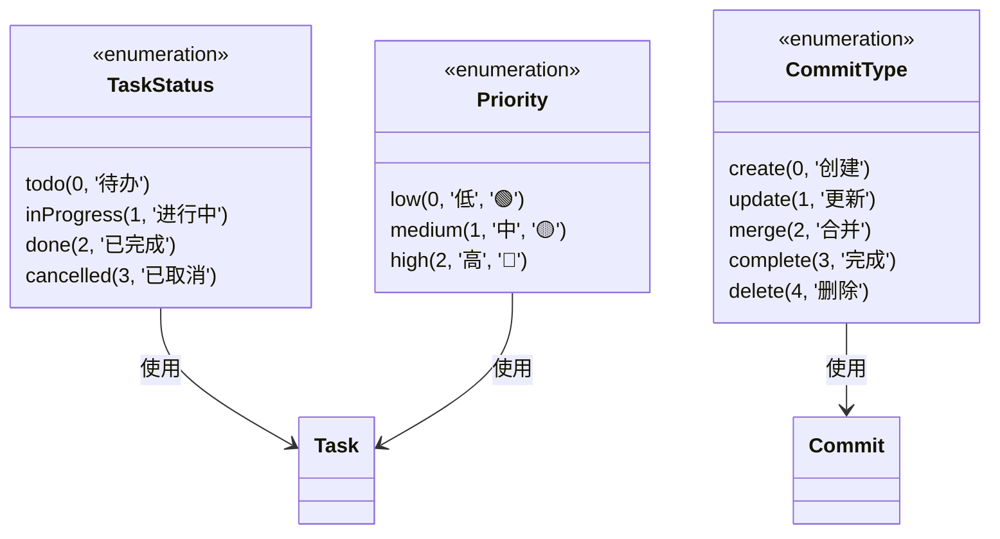
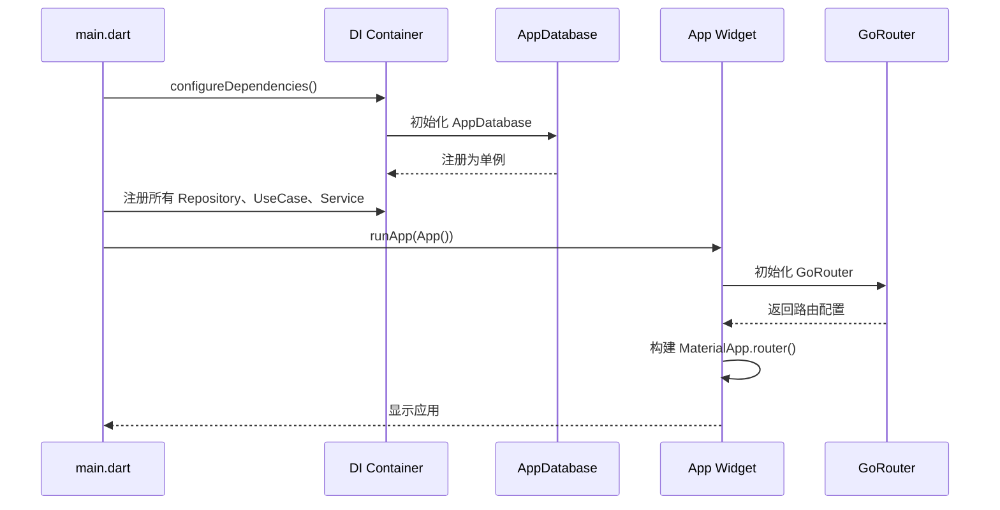
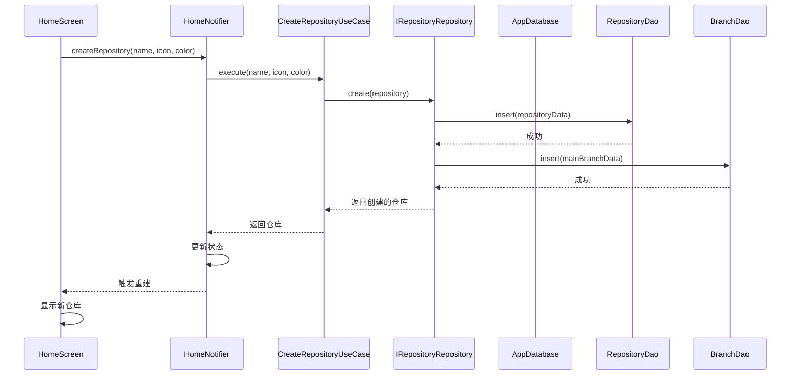
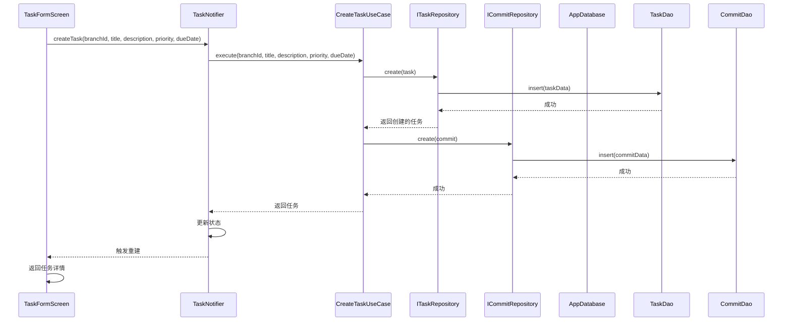
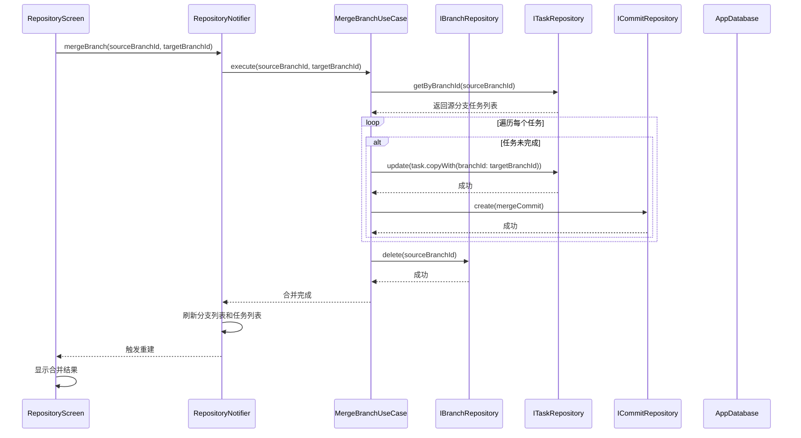
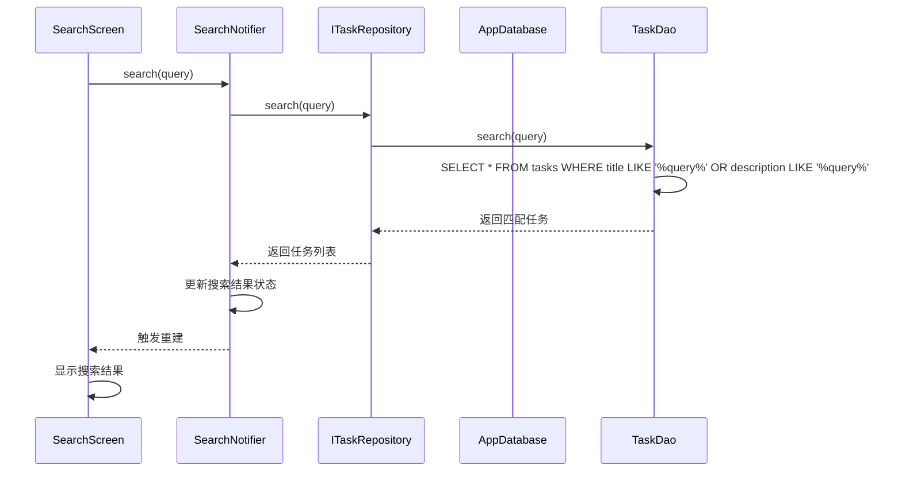
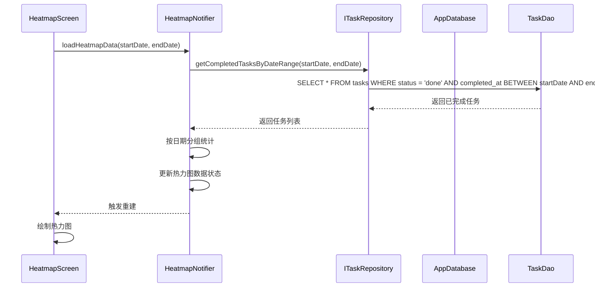
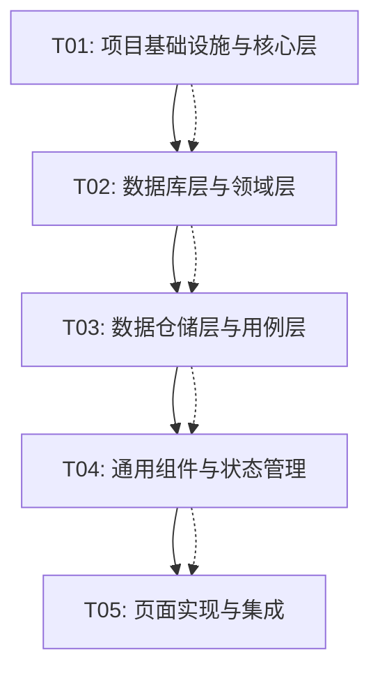

# Commit - 系统架构设计文档

**版本**: 1.0.0  
**更新日期**: 2026-05-28  
**技术栈**: Flutter 3.x + Dart  
**架构模式**: Clean Architecture + Repository Pattern

---

## Part A: 系统设计

### 1. 实现方案

#### 1.1 核心技术挑战

| 挑战 | 解决方案 |
|------|----------|
| **跨平台一致性** | Flutter 一套代码覆盖 iOS/Android/Windows/macOS |
| **复杂状态管理** | Riverpod 2.x + Notifier 模式，类型安全，支持代码生成 |
| **本地数据持久化** | drift (SQLite ORM)，类型安全，自动迁移 |
| **Clean Architecture 实施** | 严格分层：Presentation → Application → Domain ← Data |
| **响应式 UI** | Riverpod 的 AsyncValue + when() 模式处理 loading/error/data 状态 |
| **桌面端适配** | LayoutBuilder 响应式布局 + window_manager 窗口管理 |
| **Git Graph 可视化** | CustomPainter 自定义绘制，贝塞尔曲线连接节点 |
| **热力图统计** | CustomPainter 绘制 GitHub 风格贡献日历 |

#### 1.2 框架与库选型

| 类别 | 选择 | 版本 | 理由 |
|------|------|------|------|
| **状态管理** | flutter_riverpod + riverpod_annotation | ^2.5.0 | 轻量、类型安全、支持代码生成 |
| **数据库** | drift (SQLite ORM) | ^2.15.0 | 类型安全、自动迁移、减少手写 SQL |
| **路由** | go_router | ^14.0.0 | 官方推荐，支持深链接、声明式路由 |
| **DI** | get_it + injectable | ^8.0.0 / ^2.4.0 | 轻量，适合单人开发，支持代码生成 |
| **本地通知** | flutter_local_notifications | ^17.0.0 | 唯一选择，覆盖全平台 |
| **桌面端** | window_manager + system_tray | ^0.4.0 / ^2.0.0 | 窗口管理和系统托盘支持 |
| **文件操作** | path_provider + file_picker | ^2.1.0 / ^8.0.0 | 跨平台文件路径和文件选择 |
| **工具** | uuid + intl + collection | ^4.0.0 / ^0.19.0 / ^1.18.0 | UUID 生成、国际化、集合工具 |
| **UI 组件** | flutter_svg | ^2.0.0 | SVG 图标支持（Heroicons） |
| **系统功能** | shared_preferences + url_launcher | ^2.2.0 / ^6.2.0 | 本地存储和 URL 启动 |

#### 1.3 架构模式

采用 **Clean Architecture** 四层架构：

```
┌─────────────────────────────────────────────────────────────┐
│                    Presentation Layer                        │
│  ┌─────────────────────────────────────────────────────────┐│
│  │  Screens / Widgets / Providers                          ││
│  │  - 消费 Riverpod Provider/State                         ││
│  │  - 不关心数据来源                                       ││
│  └─────────────────────────────────────────────────────────┘│
├─────────────────────────────────────────────────────────────┤
│                    Application Layer                         │
│  ┌─────────────────────────────────────────────────────────┐│
│  │  Use Cases / Services                                   ││
│  │  - 业务逻辑编排                                         ││
│  │  - 调用 Repository 接口                                 ││
│  └─────────────────────────────────────────────────────────┘│
├─────────────────────────────────────────────────────────────┤
│                    Domain Layer (核心)                        │
│  ┌─────────────────────────────────────────────────────────┐│
│  │  Entities / Value Objects                               ││
│  │  - Task, Branch, Repository, Commit                     ││
│  │  - 纯 Dart，无任何外部依赖                               ││
│  ├─────────────────────────────────────────────────────────┤│
│  │  Repository Interfaces (抽象)                           ││
│  │  - ITaskRepository, IBranchRepository                   ││
│  │  - 定义契约，不关心实现                                   ││
│  └─────────────────────────────────────────────────────────┘│
├─────────────────────────────────────────────────────────────┤
│                    Data Layer (可插拔)                        │
│  ┌──────────────────┐  ┌──────────────────┐                 │
│  │  Local Data      │  │  Models          │                 │
│  │  Source           │  │  - 数据转换       │                 │
│  │  - drift (SQLite) │  │  - Entity ↔ Data │                 │
│  │  - DAO 层         │  │                  │                 │
│  └──────────────────┘  └──────────────────┘                 │
│  ┌─────────────────────────────────────────────────────────┐│
│  │  Repositories (实现)                                    ││
│  │  - LocalTaskRepository, LocalBranchRepository           ││
│  │  - 实现 Domain 层定义的接口                               ││
│  └─────────────────────────────────────────────────────────┘│
└─────────────────────────────────────────────────────────────┘
```

---

### 2. 文件列表

```
commit/
├── pubspec.yaml                                    # 依赖配置
├── analysis_options.yaml                           # 代码分析配置
├── build.yaml                                      # 代码生成配置
│
├── lib/
│   ├── main.dart                                   # 应用入口
│   ├── app.dart                                    # MaterialApp 配置
│   │
│   ├── core/                                       # 核心工具层
│   │   ├── constants/
│   │   │   ├── app_constants.dart                  # 应用常量
│   │   │   └── db_constants.dart                   # 数据库常量
│   │   ├── extensions/
│   │   │   ├── date_extensions.dart                # 日期扩展
│   │   │   └── string_extensions.dart              # 字符串扩展
│   │   ├── theme/
│   │   │   ├── app_theme.dart                      # 主题配置
│   │   │   ├── colors.dart                         # 颜色定义
│   │   │   ├── typography.dart                     # 字体定义
│   │   │   └── dimensions.dart                     # 尺寸定义
│   │   ├── utils/
│   │   │   ├── logger.dart                         # 日志工具
│   │   │   ├── validators.dart                     # 验证器
│   │   │   └── formatters.dart                     # 格式化工具
│   │   └── di/
│   │       ├── injection_container.dart            # DI 配置
│   │       └── injection_container.config.dart     # 生成的配置
│   │
│   ├── domain/                                     # 领域层
│   │   ├── entities/
│   │   │   ├── repository.dart                     # 仓库实体
│   │   │   ├── branch.dart                         # 分支实体
│   │   │   ├── task.dart                           # 任务实体
│   │   │   ├── commit.dart                         # 提交实体
│   │   │   └── enums.dart                          # 枚举定义
│   │   ├── repositories/
│   │   │   ├── i_repository_repository.dart        # 仓库接口
│   │   │   ├── i_branch_repository.dart            # 分支接口
│   │   │   ├── i_task_repository.dart              # 任务接口
│   │   │   └── i_commit_repository.dart            # 提交接口
│   │   └── usecases/
│   │       ├── repository/
│   │       │   ├── create_repository_usecase.dart  # 创建仓库
│   │       │   ├── update_repository_usecase.dart  # 更新仓库
│   │       │   └── delete_repository_usecase.dart  # 删除仓库
│   │       ├── branch/
│   │       │   ├── create_branch_usecase.dart      # 创建分支
│   │       │   ├── merge_branch_usecase.dart       # 合并分支
│   │       │   └── delete_branch_usecase.dart      # 删除分支
│   │       └── task/
│   │           ├── create_task_usecase.dart        # 创建任务
│   │           ├── update_task_usecase.dart        # 更新任务
│   │           ├── complete_task_usecase.dart      # 完成任务
│   │           └── delete_task_usecase.dart        # 删除任务
│   │
│   ├── data/                                       # 数据层
│   │   ├── database/
│   │   │   ├── app_database.dart                   # 数据库定义
│   │   │   ├── tables/
│   │   │   │   ├── repositories_table.dart         # 仓库表
│   │   │   │   ├── branches_table.dart             # 分支表
│   │   │   │   ├── tasks_table.dart                # 任务表
│   │   │   │   ├── commits_table.dart              # 提交表
│   │   │   │   ├── tags_table.dart                 # 标签表
│   │   │   │   └── task_tags_table.dart            # 任务标签关联表
│   │   │   └── daos/
│   │   │       ├── repository_dao.dart             # 仓库 DAO
│   │   │       ├── branch_dao.dart                 # 分支 DAO
│   │   │       ├── task_dao.dart                   # 任务 DAO
│   │   │       └── commit_dao.dart                 # 提交 DAO
│   │   ├── models/
│   │   │   ├── repository_model.dart               # 仓库模型
│   │   │   ├── branch_model.dart                   # 分支模型
│   │   │   ├── task_model.dart                     # 任务模型
│   │   │   └── commit_model.dart                   # 提交模型
│   │   └── repositories/
│   │       ├── local_repository_repository.dart    # 仓库仓储实现
│   │       ├── local_branch_repository.dart        # 分支仓储实现
│   │       ├── local_task_repository.dart          # 任务仓储实现
│   │       └── local_commit_repository.dart        # 提交仓储实现
│   │
│   └── presentation/                               # 表现层
│       ├── screens/
│       │   ├── home/
│       │   │   ├── home_screen.dart                # 首页
│       │   │   ├── home_state.dart                 # 首页状态
│       │   │   └── home_notifier.dart              # 首页通知器
│       │   ├── repository/
│       │   │   ├── repository_screen.dart          # 仓库详情页
│       │   │   ├── repository_state.dart           # 仓库状态
│       │   │   └── repository_notifier.dart        # 仓库通知器
│       │   ├── task/
│       │   │   ├── task_detail_screen.dart         # 任务详情页
│       │   │   ├── task_form_screen.dart           # 任务表单页
│       │   │   └── task_notifier.dart              # 任务通知器
│       │   ├── search/
│       │   │   ├── search_screen.dart              # 搜索页
│       │   │   └── search_notifier.dart            # 搜索通知器
│       │   ├── heatmap/
│       │   │   ├── heatmap_screen.dart             # 热力图页
│       │   │   └── heatmap_painter.dart            # 热力图绘制器
│       │   ├── graph/
│       │   │   ├── git_graph_screen.dart           # Git Graph 页
│       │   │   └── graph_painter.dart              # Git Graph 绘制器
│       │   └── settings/
│       │       └── settings_screen.dart            # 设置页
│       ├── widgets/
│       │   ├── common/
│       │   │   ├── app_bar_widget.dart             # 自定义 AppBar
│       │   │   ├── bottom_nav_widget.dart          # 底部导航栏
│       │   │   ├── loading_widget.dart             # 加载组件
│       │   │   ├── error_widget.dart               # 错误组件
│       │   │   ├── app_button.dart                 # 通用按钮
│       │   │   ├── app_input.dart                  # 通用输入框
│       │   │   ├── app_card.dart                   # 通用卡片
│       │   │   ├── app_badge.dart                  # 通用徽章
│       │   │   ├── app_dialog.dart                 # 通用弹窗
│       │   │   └── app_toast.dart                  # 通用 Toast
│       │   ├── task/
│       │   │   ├── task_card.dart                  # 任务卡片
│       │   │   ├── task_list.dart                  # 任务列表
│       │   │   └── task_form.dart                  # 任务表单
│       │   ├── branch/
│       │   │   ├── branch_indicator.dart           # 分支指示器
│       │   │   └── branch_list.dart                # 分支列表
│       │   ├── repository/
│       │   │   ├── repository_card.dart            # 仓库卡片
│       │   │   └── repository_list.dart            # 仓库列表
│       │   └── heatmap/
│       │       ├── heatmap_calendar.dart           # 热力图日历
│       │       └── heatmap_cell.dart               # 热力图单元格
│       └── providers/
│           ├── task_providers.dart                  # 任务相关 Provider
│           ├── branch_providers.dart                # 分支相关 Provider
│           ├── repository_providers.dart            # 仓库相关 Provider
│           ├── search_providers.dart                # 搜索相关 Provider
│           ├── heatmap_providers.dart               # 热力图相关 Provider
│           └── settings_providers.dart              # 设置相关 Provider
│
├── assets/                                         # 资源文件
│   ├── fonts/
│   │   ├── JetBrainsMono-Regular.ttf               # JetBrains Mono 字体
│   │   ├── JetBrainsMono-Medium.ttf
│   │   ├── JetBrainsMono-Bold.ttf
│   │   ├── IBMPlexSans-Regular.ttf                 # IBM Plex Sans 字体
│   │   ├── IBMPlexSans-Medium.ttf
│   │   └── IBMPlexSans-SemiBold.ttf
│   ├── icons/
│   │   └── tray_icon.png                           # 系统托盘图标
│   └── images/
│       └── empty_state.svg                         # 空状态插图
│
├── test/                                           # 测试目录
│   ├── unit/
│   │   ├── domain/
│   │   │   └── usecases/
│   │   │       └── create_task_usecase_test.dart
│   │   └── data/
│   │       └── repositories/
│   │           └── local_task_repository_test.dart
│   ├── widget/
│   │   └── widgets/
│   │       └── task_card_test.dart
│   └── integration/
│       └── app_test.dart
│
└── docs/                                           # 文档目录
    ├── PRD.md                                      # 产品需求文档
    ├── TECHNICAL.md                                # 技术设计文档
    ├── UI_DESIGN.md                                # UI 设计文档
    ├── CLAUDE.md                                   # 开发规范文档
    └── system_design.md                            # 本文档
```

---

### 3. 数据结构与接口

#### 3.1 类图

```mermaid
classDiagram
    class Repository {
        +String id
        +String name
        +String icon
        +String color
        +bool isArchived
        +DateTime createdAt
        +DateTime updatedAt
        +copyWith()
        +toJson()
    }

    class Branch {
        +String id
        +String repositoryId
        +String name
        +String? parentBranchId
        +bool isMain
        +String color
        +DateTime createdAt
        +DateTime updatedAt
        +copyWith()
        +toJson()
    }

    class Task {
        +String id
        +String branchId
        +String title
        +String? description
        +TaskStatus status
        +Priority priority
        +DateTime? dueDate
        +DateTime? completedAt
        +String? parentTaskId
        +int sortOrder
        +DateTime createdAt
        +DateTime updatedAt
        +copyWith()
        +toJson()
    }

    class Commit {
        +String id
        +String taskId
        +String branchId
        +String message
        +CommitType type
        +DateTime createdAt
        +copyWith()
        +toJson()
    }

    class IRepositoryRepository {
        <<interface>>
        +getAll() Future~List~Repository~~
        +getById(String id) Future~Repository?~
        +create(Repository repository) Future~Repository~
        +update(Repository repository) Future~Repository~
        +delete(String id) Future~void~
        +restore(String id) Future~void~
    }

    class IBranchRepository {
        <<interface>>
        +getAll() Future~List~Branch~~
        +getByRepositoryId(String repositoryId) Future~List~Branch~~
        +getById(String id) Future~Branch?~
        +create(Branch branch) Future~Branch~
        +update(Branch branch) Future~Branch~
        +delete(String id) Future~void~
    }

    class ITaskRepository {
        <<interface>>
        +getAll() Future~List~Task~~
        +getByBranchId(String branchId) Future~List~Task~~
        +getById(String id) Future~Task?~
        +create(Task task) Future~Task~
        +update(Task task) Future~Task~
        +delete(String id) Future~void~
        +search(String query) Future~List~Task~~
        +searchInRepository(String repositoryId, String query) Future~List~Task~~
    }

    class ICommitRepository {
        <<interface>>
        +getByTaskId(String taskId) Future~List~Commit~~
        +getByBranchId(String branchId) Future~List~Commit~~
        +create(Commit commit) Future~Commit~
    }

    class LocalRepositoryRepository {
        -AppDatabase _db
        +getAll() Future~List~Repository~~
        +getById(String id) Future~Repository?~
        +create(Repository repository) Future~Repository~
        +update(Repository repository) Future~Repository~
        +delete(String id) Future~void~
        +restore(String id) Future~void~
    }

    class LocalBranchRepository {
        -AppDatabase _db
        +getAll() Future~List~Branch~~
        +getByRepositoryId(String repositoryId) Future~List~Branch~~
        +getById(String id) Future~Branch?~
        +create(Branch branch) Future~Branch~
        +update(Branch branch) Future~Branch~
        +delete(String id) Future~void~
    }

    class LocalTaskRepository {
        -AppDatabase _db
        +getAll() Future~List~Task~~
        +getByBranchId(String branchId) Future~List~Task~~
        +getById(String id) Future~Task?~
        +create(Task task) Future~Task~
        +update(Task task) Future~Task~
        +delete(String id) Future~void~
        +search(String query) Future~List~Task~~
        +searchInRepository(String repositoryId, String query) Future~List~Task~~
    }

    class LocalCommitRepository {
        -AppDatabase _db
        +getByTaskId(String taskId) Future~List~Commit~~
        +getByBranchId(String branchId) Future~List~Commit~~
        +create(Commit commit) Future~Commit~
    }

    class AppDatabase {
        +RepositoryDao repositoryDao
        +BranchDao branchDao
        +TaskDao taskDao
        +CommitDao commitDao
    }

    class RepositoryDao {
        +getAll() Future~List~RepositoryData~~
        +getById(String id) Future~RepositoryData?~
        +insert(RepositoryData repository) Future~void~
        +update(RepositoryData repository) Future~void~
        +delete(String id) Future~void~
    }

    class BranchDao {
        +getAll() Future~List~BranchData~~
        +getByRepositoryId(String repositoryId) Future~List~BranchData~~
        +getById(String id) Future~BranchData?~
        +insert(BranchData branch) Future~void~
        +update(BranchData branch) Future~void~
        +delete(String id) Future~void~
    }

    class TaskDao {
        +getAll() Future~List~TaskData~~
        +getByBranchId(String branchId) Future~List~TaskData~~
        +getById(String id) Future~TaskData?~
        +insert(TaskData task) Future~void~
        +update(TaskData task) Future~void~
        +delete(String id) Future~void~
        +search(String query) Future~List~TaskData~~
        +searchInRepository(String repositoryId, String query) Future~List~TaskData~~
    }

    class CommitDao {
        +getByTaskId(String taskId) Future~List~CommitData~~
        +getByBranchId(String branchId) Future~List~CommitData~~
        +insert(CommitData commit) Future~void~
    }

    class TaskStateMachine {
        +canTransition(TaskStatus from, TaskStatus to) bool
        +transition(TaskStatus from, TaskStatus to) TaskStatus
    }

    IRepositoryRepository <|.. LocalRepositoryRepository
    IBranchRepository <|.. LocalBranchRepository
    ITaskRepository <|.. LocalTaskRepository
    ICommitRepository <|.. LocalCommitRepository

    LocalRepositoryRepository --> AppDatabase
    LocalBranchRepository --> AppDatabase
    LocalTaskRepository --> AppDatabase
    LocalCommitRepository --> AppDatabase

    AppDatabase --> RepositoryDao
    AppDatabase --> BranchDao
    AppDatabase --> TaskDao
    AppDatabase --> CommitDao

    TaskStateMachine --> Task
```



#### 3.2 枚举定义



---

### 4. 程序调用流程

#### 4.1 应用启动流程



#### 4.2 创建仓库流程



#### 4.3 创建任务流程



#### 4.4 合并分支流程



#### 4.5 全局搜索流程



#### 4.6 热力图统计流程



---

### 5. 不明确的方面与假设

| 方面 | 假设 | 理由 |
|------|------|------|
| **数据库迁移** | 使用 drift 的自动迁移 + 版本化迁移策略 | drift 支持，减少手动迁移工作 |
| **数据备份** | 仅支持 JSON 导出/导入，不支持云同步 | PRD 明确暂不实现数据同步 |
| **桌面小组件** | 仅设计 UI，不实现平台特定代码 | 实现优先级低，需要原生开发 |
| **任务依赖关系** | 暂不实现，仅支持父子任务关系 | PRD 列为 P2，后续迭代 |
| **标签系统** | 表结构已定义，但 UI 暂不实现 | PRD 列为 P2，后续迭代 |
| **通知系统** | 仅支持任务截止日期提醒，不支持自定义提醒 | 简化 MVP 范围 |
| **多语言支持** | 暂不实现国际化，仅支持中文 | 简化 MVP 范围 |
| **数据同步** | 完全本地存储，不依赖网络 | PRD 明确数据同步暂不实现 |
| **性能优化** | 使用数据库索引 + 列表懒加载 | 满足 PRD 的性能要求 |
| **错误处理** | 使用 Riverpod 的 AsyncValue 统一处理 | 标准做法，减少样板代码 |

---

## Part B: 任务分解

### 6. 必需包列表

```yaml
# pubspec.yaml
name: commit
description: 将 Git 版本控制理念应用于个人任务管理的跨平台 Flutter 应用
version: 1.0.0
publish_to: 'none'

environment:
  sdk: '>=3.0.0 <4.0.0'

dependencies:
  flutter:
    sdk: flutter
  
  # 状态管理
  flutter_riverpod: ^2.5.0
  riverpod_annotation: ^2.3.0
  
  # 数据库
  drift: ^2.15.0
  sqlite3_flutter_libs: ^0.5.0
  
  # 路由
  go_router: ^14.0.0
  
  # DI
  get_it: ^8.0.0
  injectable: ^2.4.0
  
  # 网络（后期扩展用）
  dio: ^5.4.0
  
  # 本地通知
  flutter_local_notifications: ^17.0.0
  
  # 文件操作
  path_provider: ^2.1.0
  file_picker: ^8.0.0
  
  # 工具
  uuid: ^4.0.0
  intl: ^0.19.0
  collection: ^1.18.0
  
  # UI 组件
  flutter_svg: ^2.0.0
  
  # 系统功能
  shared_preferences: ^2.2.0
  url_launcher: ^6.2.0
  
  # 桌面端支持
  window_manager: ^0.4.0
  system_tray: ^2.0.0

dev_dependencies:
  flutter_test:
    sdk: flutter
  
  # 代码生成
  build_runner: ^2.4.0
  riverpod_generator: ^2.4.0
  drift_dev: ^2.15.0
  injectable_generator: ^2.6.0
  
  # 代码规范
  flutter_lints: ^4.0.0
  very_good_analysis: ^5.1.0
  
  # 测试
  mockito: ^5.4.0
  build_verify: ^3.1.0

flutter:
  uses-material-design: true
  
  fonts:
    - family: JetBrains Mono
      fonts:
        - asset: assets/fonts/JetBrainsMono-Regular.ttf
        - asset: assets/fonts/JetBrainsMono-Medium.ttf
          weight: 500
        - asset: assets/fonts/JetBrainsMono-Bold.ttf
          weight: 700
    - family: IBM Plex Sans
      fonts:
        - asset: assets/fonts/IBMPlexSans-Regular.ttf
        - asset: assets/fonts/IBMPlexSans-Medium.ttf
          weight: 500
        - asset: assets/fonts/IBMPlexSans-SemiBold.ttf
          weight: 600

  assets:
    - assets/icons/
    - assets/images/
```

---

### 7. 任务列表（按依赖顺序）

#### T01: 项目基础设施与核心层

**任务 ID**: T01  
**任务名称**: 项目基础设施与核心层  
**优先级**: P0  
**依赖**: 无

**涉及文件**:
- `pubspec.yaml`
- `analysis_options.yaml`
- `build.yaml`
- `lib/main.dart`
- `lib/app.dart`
- `lib/core/constants/app_constants.dart`
- `lib/core/constants/db_constants.dart`
- `lib/core/extensions/date_extensions.dart`
- `lib/core/extensions/string_extensions.dart`
- `lib/core/theme/app_theme.dart`
- `lib/core/theme/colors.dart`
- `lib/core/theme/typography.dart`
- `lib/core/theme/dimensions.dart`
- `lib/core/utils/logger.dart`
- `lib/core/utils/validators.dart`
- `lib/core/utils/formatters.dart`
- `lib/core/di/injection_container.dart`
- `assets/fonts/` (字体文件)
- `assets/icons/` (图标文件)
- `assets/images/` (图片文件)

**实现要点**:
1. 创建 Flutter 项目，配置 pubspec.yaml 依赖
2. 配置 analysis_options.yaml 代码规范
3. 配置 build.yaml 代码生成选项
4. 实现 core 层所有工具类：
   - 颜色、字体、尺寸等设计系统常量
   - 日期、字符串扩展方法
   - 日志、验证、格式化工具
5. 配置 get_it + injectable 依赖注入
6. 创建 main.dart 入口和 app.dart 路由配置
7. 下载并配置 JetBrains Mono 和 IBM Plex Sans 字体
8. 准备 Heroicons SVG 图标资源

**输出验证**:
- 应用可以正常启动
- 主题配置生效
- DI 容器正常工作

---

#### T02: 数据库层与领域层

**任务 ID**: T02  
**任务名称**: 数据库层与领域层  
**优先级**: P0  
**依赖**: T01

**涉及文件**:
- `lib/domain/entities/repository.dart`
- `lib/domain/entities/branch.dart`
- `lib/domain/entities/task.dart`
- `lib/domain/entities/commit.dart`
- `lib/domain/entities/enums.dart`
- `lib/domain/repositories/i_repository_repository.dart`
- `lib/domain/repositories/i_branch_repository.dart`
- `lib/domain/repositories/i_task_repository.dart`
- `lib/domain/repositories/i_commit_repository.dart`
- `lib/data/database/tables/repositories_table.dart`
- `lib/data/database/tables/branches_table.dart`
- `lib/data/database/tables/tasks_table.dart`
- `lib/data/database/tables/commits_table.dart`
- `lib/data/database/tables/tags_table.dart`
- `lib/data/database/tables/task_tags_table.dart`
- `lib/data/database/daos/repository_dao.dart`
- `lib/data/database/daos/branch_dao.dart`
- `lib/data/database/daos/task_dao.dart`
- `lib/data/database/daos/commit_dao.dart`
- `lib/data/database/app_database.dart`
- `lib/data/models/repository_model.dart`
- `lib/data/models/branch_model.dart`
- `lib/data/models/task_model.dart`
- `lib/data/models/commit_model.dart`

**实现要点**:
1. 定义 Domain 层实体类（Repository、Branch、Task、Commit）
2. 定义枚举（TaskStatus、Priority、CommitType）
3. 定义 Repository 接口（IRepositoryRepository、IBranchRepository、ITaskRepository、ICommitRepository）
4. 实现 drift 表定义（Repositories、Branches、Tasks、Commits、Tags、TaskTags）
5. 实现 DAO 层（RepositoryDao、BranchDao、TaskDao、CommitDao）
6. 实现 AppDatabase 类，配置表和迁移策略
7. 实现数据模型（Model），包含 Entity ↔ Data 转换方法
8. 运行 build_runner 生成 drift 代码

**输出验证**:
- drift 代码生成成功
- 数据库可以正常创建和迁移
- 所有实体类和接口定义正确

---

#### T03: 数据仓储层与用例层

**任务 ID**: T03  
**任务名称**: 数据仓储层与用例层  
**优先级**: P0  
**依赖**: T02

**涉及文件**:
- `lib/data/repositories/local_repository_repository.dart`
- `lib/data/repositories/local_branch_repository.dart`
- `lib/data/repositories/local_task_repository.dart`
- `lib/data/repositories/local_commit_repository.dart`
- `lib/domain/usecases/repository/create_repository_usecase.dart`
- `lib/domain/usecases/repository/update_repository_usecase.dart`
- `lib/domain/usecases/repository/delete_repository_usecase.dart`
- `lib/domain/usecases/branch/create_branch_usecase.dart`
- `lib/domain/usecases/branch/merge_branch_usecase.dart`
- `lib/domain/usecases/branch/delete_branch_usecase.dart`
- `lib/domain/usecases/task/create_task_usecase.dart`
- `lib/domain/usecases/task/update_task_usecase.dart`
- `lib/domain/usecases/task/complete_task_usecase.dart`
- `lib/domain/usecases/task/delete_task_usecase.dart`

**实现要点**:
1. 实现 LocalRepositoryRepository，包含自动创建 main 分支逻辑
2. 实现 LocalBranchRepository，包含分支 CRUD 操作
3. 实现 LocalTaskRepository，包含任务搜索功能
4. 实现 LocalCommitRepository，包含提交历史记录
5. 实现所有 Use Case 类，遵循单一职责原则
6. 实现 MergeBranchUseCase，包含分支合并算法
7. 实现 CompleteTaskUseCase，包含任务状态机验证
8. 注册所有 Repository 和 Use Case 到 DI 容器

**输出验证**:
- 所有 Repository 实现正确
- 所有 Use Case 可以正常调用
- 分支合并算法正确
- 任务状态机验证正确

---

#### T04: 通用组件与状态管理

**任务 ID**: T04  
**任务名称**: 通用组件与状态管理  
**优先级**: P0  
**依赖**: T03

**涉及文件**:
- `lib/presentation/widgets/common/app_bar_widget.dart`
- `lib/presentation/widgets/common/bottom_nav_widget.dart`
- `lib/presentation/widgets/common/loading_widget.dart`
- `lib/presentation/widgets/common/error_widget.dart`
- `lib/presentation/widgets/common/app_button.dart`
- `lib/presentation/widgets/common/app_input.dart`
- `lib/presentation/widgets/common/app_card.dart`
- `lib/presentation/widgets/common/app_badge.dart`
- `lib/presentation/widgets/common/app_dialog.dart`
- `lib/presentation/widgets/common/app_toast.dart`
- `lib/presentation/widgets/task/task_card.dart`
- `lib/presentation/widgets/task/task_list.dart`
- `lib/presentation/widgets/task/task_form.dart`
- `lib/presentation/widgets/branch/branch_indicator.dart`
- `lib/presentation/widgets/branch/branch_list.dart`
- `lib/presentation/widgets/repository/repository_card.dart`
- `lib/presentation/widgets/repository/repository_list.dart`
- `lib/presentation/widgets/heatmap/heatmap_calendar.dart`
- `lib/presentation/widgets/heatmap/heatmap_cell.dart`
- `lib/presentation/providers/task_providers.dart`
- `lib/presentation/providers/branch_providers.dart`
- `lib/presentation/providers/repository_providers.dart`
- `lib/presentation/providers/search_providers.dart`
- `lib/presentation/providers/heatmap_providers.dart`
- `lib/presentation/providers/settings_providers.dart`

**实现要点**:
1. 实现通用 UI 组件（AppButton、AppInput、AppCard、AppBadge、AppDialog、AppToast）
2. 实现任务相关组件（TaskCard、TaskList、TaskForm）
3. 实现分支相关组件（BranchIndicator、BranchList）
4. 实现仓库相关组件（RepositoryCard、RepositoryList）
5. 实现热力图组件（HeatmapCalendar、HeatmapCell）
6. 实现所有 Riverpod Provider，使用 @riverpod 注解
7. 实现 Notifier 类，管理 AsyncValue 状态
8. 实现设置 Provider，使用 SharedPreferences 存储

**输出验证**:
- 所有通用组件可以正常使用
- Provider 可以正常提供数据
- 组件样式符合 UI 设计文档

---

#### T05: 页面实现与集成

**任务 ID**: T05  
**任务名称**: 页面实现与集成  
**优先级**: P0  
**依赖**: T04

**涉及文件**:
- `lib/presentation/screens/home/home_screen.dart`
- `lib/presentation/screens/home/home_state.dart`
- `lib/presentation/screens/home/home_notifier.dart`
- `lib/presentation/screens/repository/repository_screen.dart`
- `lib/presentation/screens/repository/repository_state.dart`
- `lib/presentation/screens/repository/repository_notifier.dart`
- `lib/presentation/screens/task/task_detail_screen.dart`
- `lib/presentation/screens/task/task_form_screen.dart`
- `lib/presentation/screens/task/task_notifier.dart`
- `lib/presentation/screens/search/search_screen.dart`
- `lib/presentation/screens/search/search_notifier.dart`
- `lib/presentation/screens/heatmap/heatmap_screen.dart`
- `lib/presentation/screens/heatmap/heatmap_painter.dart`
- `lib/presentation/screens/graph/git_graph_screen.dart`
- `lib/presentation/screens/graph/graph_painter.dart`
- `lib/presentation/screens/settings/settings_screen.dart`
- `lib/presentation/screens/settings/settings_notifier.dart`

**实现要点**:
1. 实现首页（HomePage），包含仓库列表、快速添加按钮、底部导航栏
2. 实现仓库详情页（RepositoryPage），包含分支列表、任务列表、分支切换
3. 实现任务详情页（TaskDetailPage），包含任务信息、子任务、提交历史
4. 实现任务表单页（TaskFormPage），用于创建和编辑任务
5. 实现搜索页（SearchPage），包含全局搜索、搜索历史、筛选条件
6. 实现热力图页（HeatmapPage），使用 CustomPainter 绘制贡献日历
7. 实现 Git Graph 页（GitGraphPage），使用 CustomPainter 绘制分支图
8. 实现设置页（SettingsPage），包含外观、通知、数据管理设置
9. 配置 go_router 路由，实现页面间导航
10. 集成所有组件和 Provider，完成端到端功能

**输出验证**:
- 所有页面可以正常显示和交互
- 路由导航正常工作
- 数据流完整：UI → Provider → UseCase → Repository → DAO → Database
- 搜索功能正常工作
- 热力图和 Git Graph 可以正常绘制

---

### 8. 共享知识

#### 8.1 命名规范

| 类型 | 命名规范 | 示例 |
|------|---------|------|
| **文件名** | 小写 + 下划线 | `task_card.dart` |
| **类名** | 大驼峰 | `TaskCard` |
| **变量名** | 小驼峰 | `taskId` |
| **常量名** | 小驼峰 | `maxTaskTitleLength` |
| **枚举值** | 小驼峰 | `TaskStatus.inProgress` |
| **Provider 名** | 小驼峰 + provider 后缀 | `taskNotifierProvider` |

#### 8.2 接口约定

- **Repository 接口**: 以 `I` 前缀命名，定义在 domain/repositories/ 目录
- **Use Case**: 单一职责，只有一个 `execute()` 方法
- **Provider**: 使用 @riverpod 注解，自动生成 Provider
- **Notifier**: 继承自 _$Notifier，管理 AsyncValue 状态
- **DAO**: 使用 @DriftAccessor 注解，继承 DatabaseAccessor

#### 8.3 状态管理约定

- **AsyncValue**: 统一处理 loading、error、data 三种状态
- **when()**: 在 UI 中使用 when() 方法处理不同状态
- **ref.invalidateSelf()**: 数据变更后刷新 Provider
- **ref.read()**: 在 Notifier 中读取其他 Provider
- **ref.watch()**: 在 UI 中监听 Provider 变化

#### 8.4 数据库约定

- **软删除**: 使用 `isDeleted` 字段，不实际删除数据
- **时间戳**: 所有表包含 `createdAt` 和 `updatedAt` 字段
- **UUID**: 所有 ID 使用 UUID v4 格式
- **索引**: 为常用查询字段创建索引（branch_id、status、due_date）

#### 8.5 UI 约定

- **间距**: 使用 4px 网格系统（AppDimensions）
- **圆角**: 使用预定义圆角尺寸（radiusXs、radiusSm、radiusMd 等）
- **颜色**: 使用 AppColors 颜色常量，不使用硬编码颜色值
- **字体**: 使用 AppTypography 字体常量，不使用硬编码字体样式
- **图标**: 使用 Heroicons SVG 图标，不使用 Material Icons

#### 8.6 错误处理约定

- **Repository 层**: 捕获数据库异常，抛出自定义异常
- **Use Case 层**: 验证输入参数，抛出 ArgumentError
- **Notifier 层**: 使用 try-catch 包裹 Use Case 调用，更新 AsyncValue.error
- **UI 层**: 使用 AsyncValue.when() 处理错误状态，显示 ErrorWidget

#### 8.7 测试约定

- **单元测试**: 测试 Use Case 和 Repository 的业务逻辑
- **Widget 测试**: 测试 UI 组件的行为
- **集成测试**: 测试端到端的功能流程
- **Mock**: 使用 mockito 生成 Mock 对象
- **AAA 模式**: Arrange-Act-Assert 测试结构

---

### 9. 任务依赖图



**任务依赖说明**:
- **T01** → **T02**: 核心层（主题、工具、DI）是数据库和领域层的基础
- **T02** → **T03**: 数据库表和领域实体是仓储层和用例层的前提
- **T03** → **T04**: 仓储层和用例层是 UI 组件和状态管理的数据来源
- **T04** → **T05**: 通用组件和状态管理是页面实现的基础

---

## 附录

### A. 关键技术决策记录

| 决策 | 选择 | 理由 | 替代方案 |
|------|------|------|----------|
| **状态管理** | Riverpod 2.x | 轻量、类型安全、支持代码生成 | Bloc、Provider、GetX |
| **数据库** | drift (SQLite ORM) | 类型安全、自动迁移、减少手写 SQL | sqflite、hive、isar |
| **路由** | go_router | 官方推荐、支持深链接、声明式路由 | auto_route、Navigator 2.0 |
| **DI** | get_it + injectable | 轻量、适合单人开发、支持代码生成 | riverpod、kiwi |
| **代码生成** | build_runner | Flutter 生态标准、支持多种生成器 | 自定义脚本 |
| **代码规范** | very_good_analysis | 严格、全面、社区认可 | flutter_lints、pedantic |

### B. 性能优化策略

| 策略 | 实现方式 | 预期效果 |
|------|----------|----------|
| **数据库索引** | 为 branch_id、status、due_date 创建索引 | 查询 < 100ms |
| **列表懒加载** | 使用 ListView.builder + 缓存 | 滚动流畅 60fps |
| **Provider 缓存** | 使用 keepAlive + 自动刷新 | 减少重复查询 |
| **图片缓存** | 使用 cached_network_image | 减少网络请求 |
| **代码分割** | 按页面懒加载 | 启动时间 < 2s |

### C. 安全考虑

| 方面 | 措施 |
|------|------|
| **数据存储** | 本地 SQLite 数据库，不上传云端 |
| **数据备份** | 支持 JSON 导出，用户自行备份 |
| **输入验证** | 所有用户输入进行验证和清理 |
| **SQL 注入** | 使用 drift ORM，参数化查询 |
| **敏感信息** | 不收集用户个人信息 |

---

**文档维护**: 软件架构师  
**最后更新**: 2026-05-28  
**版本**: 1.0.0
