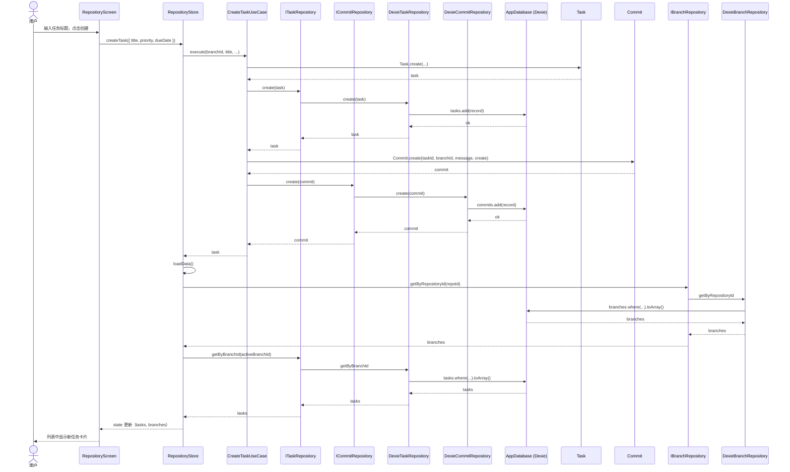

# Commit Web 端架构设计文档

**版本**: 1.0.0  
**创建日期**: 2026-07-05  
**作者**: 架构师 高见远  
**关联文档**: `docs/PRD.md`、`docs/WEB_INTEGRATION_DESIGN.md`、`docs/DESIGN.md`  

---

## 1. 项目概述

Commit Web 端是现有 Flutter 桌面/移动应用的功能对等 Web 版本，作为 Monorepo 的 `web/` 子目录存在。Web 端采用 **Vite 6 + React 18 + TypeScript 5 + Tailwind CSS 4 + Radix UI + Dexie.js** 技术栈，数据完全存储于浏览器 IndexedDB，支持响应式布局、深色/浅色主题切换与 PWA 安装。

### 核心设计目标

1. **功能对等**：覆盖仓库、分支、任务、提交历史、全局搜索、热力图、Git Graph 等核心能力。
2. **原生 Web 体验**：使用 DOM 原生交互，拒绝 Flutter Web 的 Canvas 渲染模型。
3. **设计一致性**：严格以 `docs/DESIGN.md` 为唯一视觉来源，通过 CSS Variables 映射 `AppThemeColors`。
4. **架构可扩展**：采用 Repository 接口模式，Dexie.js 只是当前本地实现，未来可无缝切换为远程后端。

---

## 2. 实现方案与框架选型

### 2.1 技术挑战与解决策略

| 挑战 | 解决策略 |
|------|----------|
| 本地存储从 SQLite 迁移到 Web | 使用 Dexie.js 封装 IndexedDB，schema 与 Flutter 端 6 张表对齐 |
| 主题系统跨技术栈映射 | `AppThemeColors` → CSS Variables + `.dark/.light` class 切换，Tailwind 引用变量 |
| 响应式布局复刻 | `ResponsiveLayout` / `SplitView` → `useBreakpoint` hook + 条件渲染 |
| Git Graph 可视化 | ReactFlow 12 替代 Flutter CustomPainter，支持 pinch-to-zoom 与虚拟化 |
| 状态管理模式映射 | Riverpod `Notifier + State` → Zustand 每屏独立 store |
| DI 容器映射 | get_it/injectable → tsyringe |

### 2.2 框架与库选型（含版本）

| 维度 | 选型 | 版本 | 理由 |
|------|------|------|------|
| 框架 | React | 18.3.x | 生态成熟，原生 DOM 交互 |
| 语言 | TypeScript | 5.5.x | 类型安全，便于与 Dart 模型对齐 |
| 构建工具 | Vite | 6.0.x | 极速 HMR、生产构建优秀、PWA 插件成熟 |
| 样式 | Tailwind CSS | 4.0.x | 原子化 CSS，精准映射 DESIGN.md token |
| UI 基础 | Radix UI | latest | Headless 无障碍基础组件 |
| 状态管理 | Zustand | 5.0.x | 轻量，每屏独立 store |
| 路由 | React Router | 7.x | 嵌套路由 + Outlet，适配 AppLayout |
| 本地存储 | Dexie.js | 4.0.x | IndexedDB 封装，支持索引/事务 |
| Git Graph | ReactFlow | 12.x | 内置 pan/zoom、自定义节点/连线 |
| 虚拟列表 | @tanstack/react-virtual | 3.x | 长列表性能优化 |
| 日期处理 | date-fns | 4.x | 轻量，替代 intl |
| UUID | uuid | 10.x | 与 Dart 端一致生成 v4 UUID |
| DI | tsyringe | 4.8.x | 轻量 DI 容器，类比 get_it |
| 图标 | lucide-react | latest | 对标 AppIcons (Heroicons) |
| PWA | vite-plugin-pwa | latest | Service Worker + manifest |

### 2.3 架构模式

采用 **分层架构**，与 Flutter 端对齐：

```
Presentation (Screens + Stores + Components)
      │
Application (UseCases)
      │
Domain (Entities + Repository Interfaces)
      │
Data (Dexie.js DB + Models + Dexie*Repository 实现)
```

- **Domain 层**：纯 TypeScript，无外部依赖，定义实体、枚举、Repository 接口。
- **Application 层**：单一职责 UseCase，编排 Repository 与 Domain Services。
- **Data 层**：Dexie.js 实现 Repository 接口，负责 IndexedDB 操作与 Entity/Record 转换。
- **Presentation 层**：React 组件 + Zustand store，每屏独立状态管理。

---

## 3. 项目目录结构

```
web/
├── public/
│   ├── favicon.svg
│   ├── manifest.json              # PWA manifest
│   ├── robots.txt
│   └── icons/
│       ├── icon-192x192.png
│       ├── icon-512x512.png
│       └── maskable-icon.png
├── src/
│   ├── app.tsx                    # 根组件 + Router + ThemeProvider
│   ├── main.tsx                   # 应用入口
│   ├── index.css                  # Tailwind + CSS Variables + 字体
│   │
│   ├── domain/                    # 纯 TS，无外部依赖
│   │   ├── entities/
│   │   │   ├── repository.ts
│   │   │   ├── branch.ts
│   │   │   ├── task.ts
│   │   │   ├── commit.ts
│   │   │   └── enums.ts
│   │   ├── repositories/
│   │   │   ├── i-repository-repository.ts
│   │   │   ├── i-branch-repository.ts
│   │   │   ├── i-task-repository.ts
│   │   │   └── i-commit-repository.ts
│   │   └── services/
│   │       └── data-export-service.ts
│   │
│   ├── application/               # UseCase 层
│   │   └── usecases/
│   │       ├── repository/
│   │       │   ├── create-repository-usecase.ts
│   │       │   ├── update-repository-usecase.ts
│   │       │   └── delete-repository-usecase.ts
│   │       ├── branch/
│   │       │   ├── create-branch-usecase.ts
│   │       │   ├── merge-branch-usecase.ts
│   │       │   └── delete-branch-usecase.ts
│   │       └── task/
│   │           ├── create-task-usecase.ts
│   │           ├── update-task-usecase.ts
│   │           ├── complete-task-usecase.ts
│   │           └── delete-task-usecase.ts
│   │
│   ├── data/                      # Dexie.js 实现
│   │   ├── db/
│   │   │   └── app-database.ts    # 6 表 + 索引定义
│   │   ├── models/
│   │   │   ├── repository-model.ts
│   │   │   ├── branch-model.ts
│   │   │   ├── task-model.ts
│   │   │   └── commit-model.ts
│   │   └── repositories/
│   │       ├── dexie-repository-repository.ts
│   │       ├── dexie-branch-repository.ts
│   │       ├── dexie-task-repository.ts
│   │       └── dexie-commit-repository.ts
│   │
│   ├── presentation/              # React UI
│   │   ├── screens/
│   │   │   ├── home-screen.tsx
│   │   │   ├── repository-screen.tsx
│   │   │   ├── task-detail-screen.tsx
│   │   │   ├── task-form-screen.tsx
│   │   │   ├── search-screen.tsx
│   │   │   ├── heatmap-screen.tsx
│   │   │   ├── git-graph-screen.tsx
│   │   │   └── settings-screen.tsx
│   │   ├── stores/
│   │   │   ├── home-store.ts
│   │   │   ├── repository-store.ts
│   │   │   ├── task-store.ts
│   │   │   ├── search-store.ts
│   │   │   └── settings-store.ts
│   │   ├── components/
│   │   │   ├── common/
│   │   │   │   ├── app-button.tsx
│   │   │   │   ├── app-card.tsx
│   │   │   │   ├── app-badge.tsx
│   │   │   │   ├── app-input.tsx
│   │   │   │   ├── app-dialog.tsx
│   │   │   │   ├── app-toast.tsx
│   │   │   │   ├── app-date-picker.tsx
│   │   │   │   ├── app-segmented-control.tsx
│   │   │   │   ├── hero-empty-state.tsx
│   │   │   │   ├── responsive-builder.tsx
│   │   │   │   ├── split-view.tsx
│   │   │   │   ├── side-nav.tsx
│   │   │   │   ├── bottom-nav.tsx
│   │   │   │   ├── bottom-sheet.tsx
│   │   │   │   ├── fab.tsx
│   │   │   │   ├── pull-to-refresh.tsx
│   │   │   │   ├── loading-widget.tsx
│   │   │   │   └── error-widget.tsx
│   │   │   ├── layout/
│   │   │   │   ├── app-layout.tsx
│   │   │   │   └── safe-area.tsx
│   │   │   ├── repository/
│   │   │   │   ├── repository-card.tsx
│   │   │   │   └── repository-list.tsx
│   │   │   ├── branch/
│   │   │   │   ├── branch-indicator.tsx
│   │   │   │   └── branch-list.tsx
│   │   │   ├── task/
│   │   │   │   ├── task-card.tsx
│   │   │   │   ├── task-list.tsx
│   │   │   │   └── task-form.tsx
│   │   │   ├── heatmap/
│   │   │   │   ├── heatmap-calendar.tsx
│   │   │   │   └── heatmap-cell.tsx
│   │   │   └── graph/
│   │   │       ├── commit-node.tsx
│   │   │       └── branch-edge.tsx
│   │   └── icons/
│   │       └── app-icons.tsx       # AppIconName → Lucide 映射
│   │
│   ├── core/                       # 主题/工具/DI
│   │   ├── theme/
│   │   │   ├── colors.ts           # CSS Variables token 定义
│   │   │   ├── typography.ts       # 字体/字号/字距常量
│   │   │   ├── dimensions.ts       # 间距/圆角/断点/阴影/动画
│   │   │   └── theme-provider.tsx  # 主题应用与 themeColor 动态覆盖
│   │   ├── hooks/
│   │   │   ├── use-breakpoint.ts
│   │   │   ├── use-is-mobile.ts
│   │   │   ├── use-is-desktop.ts   # ≥840px 导航断点
│   │   │   ├── use-is-wide.ts      # ≥1024px SplitView 断点
│   │   │   └── use-swipe.ts
│   │   ├── di/
│   │   │   └── injection-container.ts
│   │   ├── constants/
│   │   │   └── app-constants.ts
│   │   ├── extensions/
│   │   │   ├── date-extensions.ts
│   │   │   └── string-extensions.ts
│   │   └── utils/
│   │       ├── formatters.ts
│   │       ├── validators.ts
│   │       └── logger.ts
│   │
│   └── platform/                   # Web 平台特定能力
│       ├── web-notification-service.ts
│       └── web-file-save-service.ts
│
├── shared/                         # 两端共享数据契约
│   └── schemas/
│       └── export-schema.json
│
├── index.html
├── package.json
├── tsconfig.json
├── tsconfig.app.json
├── tsconfig.node.json
├── vite.config.ts
├── tailwind.config.ts
└── eslint.config.js
```

---

## 4. 数据结构与接口

> 以下类图展示核心实体、枚举、Repository 接口、关键 UseCase 与 Store 之间的关系。`--|` 表示实现接口，`-->` 表示依赖/引用，`--*` 表示一对多关联。

```mermaid
classDiagram
    direction LR

    class TaskStatus {
        <<enumeration>>
        +todo = 0
        +inProgress = 1
        +done = 2
        +cancelled = 3
        +value: number
        +label: string
        +fromValue(value: number)$ TaskStatus
    }

    class Priority {
        <<enumeration>>
        +low = 0
        +medium = 1
        +high = 2
        +value: number
        +label: string
        +fromValue(value: number)$ Priority
    }

    class CommitType {
        <<enumeration>>
        +create = 0
        +update = 1
        +merge = 2
        +complete = 3
        +delete = 4
        +value: number
        +label: string
        +fromValue(value: number)$ CommitType
    }

    class Repository {
        +String id
        +String name
        +String icon
        +String color
        +Boolean isArchived
        +Boolean isDeleted
        +Date createdAt
        +Date updatedAt
        +create(name, icon, color)$ Repository
        +copyWith(...)$ Repository
        +toJson() Object
    }

    class Branch {
        +String id
        +String repositoryId
        +String name
        +String? parentBranchId
        +Boolean isMain
        +String color
        +Boolean isDeleted
        +Date createdAt
        +Date updatedAt
        +create(repositoryId, name, ...)$ Branch
        +copyWith(...)$ Branch
        +toJson() Object
    }

    class Task {
        +String id
        +String branchId
        +String title
        +String? description
        +TaskStatus status
        +Priority priority
        +Date? dueDate
        +Date? completedAt
        +String? parentTaskId
        +Number sortOrder
        +Boolean isDeleted
        +Date createdAt
        +Date updatedAt
        +create(branchId, title, ...)$ Task
        +copyWith(...)$ Task
        +toJson() Object
        +isCompleted Boolean
        +isOverdue Boolean
    }

    class Commit {
        +String id
        +String taskId
        +String branchId
        +String message
        +CommitType type
        +Date createdAt
        +create(taskId, branchId, message, type)$ Commit
        +copyWith(...)$ Commit
        +toJson() Object
    }

    class IRepositoryRepository {
        <<interface>>
        +getAll() Promise~Repository[]~
        +getById(id) Promise~Repository?~
        +create(repository) Promise~Repository~
        +update(repository) Promise~Repository~
        +delete(id) Promise~void~
        +restore(id) Promise~void~
    }

    class IBranchRepository {
        <<interface>>
        +getAll() Promise~Branch[]~
        +getByRepositoryId(id) Promise~Branch[]~
        +getById(id) Promise~Branch?~
        +create(branch) Promise~Branch~
        +update(branch) Promise~Branch~
        +delete(id) Promise~void~
    }

    class ITaskRepository {
        <<interface>>
        +getAll() Promise~Task[]~
        +getByBranchId(id) Promise~Task[]~
        +getById(id) Promise~Task?~
        +create(task) Promise~Task~
        +update(task) Promise~Task~
        +delete(id) Promise~void~
        +search(query) Promise~Task[]~
        +searchInRepository(repoId, query) Promise~Task[]~
        +getCompletedByDateRange(start, end) Promise~Task[]~
    }

    class ICommitRepository {
        <<interface>>
        +getByTaskId(id) Promise~Commit[]~
        +getByBranchId(id) Promise~Commit[]~
        +create(commit) Promise~Commit~
    }

    class DexieRepositoryRepository {
        -AppDatabase db
        +getAll() Promise~Repository[]~
        ...
    }

    class DexieBranchRepository {
        -AppDatabase db
        +getByRepositoryId(id) Promise~Branch[]~
        ...
    }

    class DexieTaskRepository {
        -AppDatabase db
        +search(query) Promise~Task[]~
        +getCompletedByDateRange(s, e) Promise~Task[]~
        ...
    }

    class DexieCommitRepository {
        -AppDatabase db
        ...
    }

    class AppDatabase {
        +Table~RepositoryRecord, string~ repositories
        +Table~BranchRecord, string~ branches
        +Table~TaskRecord, string~ tasks
        +Table~CommitRecord, string~ commits
        +Table~TagRecord, string~ tags
        +Table~TaskTagRecord, [string,string]~ taskTags
    }

    class CreateTaskUseCase {
        -ITaskRepository taskRepo
        -ICommitRepository commitRepo
        +execute(params) Promise~Task~
    }

    class MergeBranchUseCase {
        -IBranchRepository branchRepo
        -ITaskRepository taskRepo
        -ICommitRepository commitRepo
        +execute(sourceId, targetId) Promise~void~
    }

    class DataExportService {
        -IRepositoryRepository repoRepo
        -IBranchRepository branchRepo
        -ITaskRepository taskRepo
        -ICommitRepository commitRepo
        +export(format) Promise~string~
    }

    class RepositoryStore {
        +Repository? repository
        +Branch[] branches
        +Task[] tasks
        +String? activeBranchId
        +String? selectedTaskId
        +Boolean isLoading
        +String? error
        +loadData() Promise~void~
        +switchBranch(id) Promise~void~
        +createTask(params) Promise~Task?~
        +completeTask(id) Promise~void~
        +deleteTask(id) Promise~void~
        +createBranch(params) Promise~void~
        +mergeBranch(sourceId, targetId) Promise~void~
        +selectTask(id) void
    }

    Task --> TaskStatus
    Task --> Priority
    Commit --> CommitType
    Branch --> Repository : repositoryId
    Task --> Branch : branchId
    Task --> Task : parentTaskId
    Commit --> Task : taskId
    Commit --> Branch : branchId

    DexieRepositoryRepository --|> IRepositoryRepository
    DexieBranchRepository --|> IBranchRepository
    DexieTaskRepository --|> ITaskRepository
    DexieCommitRepository --|> ICommitRepository

    DexieRepositoryRepository --> AppDatabase
    DexieBranchRepository --> AppDatabase
    DexieTaskRepository --> AppDatabase
    DexieCommitRepository --> AppDatabase

    CreateTaskUseCase --> ITaskRepository
    CreateTaskUseCase --> ICommitRepository
    MergeBranchUseCase --> IBranchRepository
    MergeBranchUseCase --> ITaskRepository
    MergeBranchUseCase --> ICommitRepository
    DataExportService --> IRepositoryRepository
    DataExportService --> IBranchRepository
    DataExportService --> ITaskRepository
    DataExportService --> ICommitRepository

    RepositoryStore --> IRepositoryRepository
    RepositoryStore --> IBranchRepository
    RepositoryStore --> ITaskRepository
    RepositoryStore --> ICommitRepository
    RepositoryStore --> CreateTaskUseCase
```



---

## 5. 程序调用流程

> 以下时序图展示「在仓库详情页创建任务」的完整调用链，覆盖 UI → Store → UseCase → Repository → Dexie → IndexedDB 的层级交互。



---

## 6. 依赖包列表

### 6.1 dependencies

```json
{
  "react": "^18.3.1",
  "react-dom": "^18.3.1",
  "react-router-dom": "^7.0.0",
  "zustand": "^5.0.0",
  "dexie": "^4.0.10",
  "reactflow": "^12.3.0",
  "date-fns": "^4.1.0",
  "uuid": "^10.0.0",
  "tsyringe": "^4.8.0",
  "reflect-metadata": "^0.2.2",
  "@tanstack/react-virtual": "^3.10.0",
  "lucide-react": "^0.460.0",
  "@radix-ui/react-dialog": "^1.1.0",
  "@radix-ui/react-popover": "^1.1.0",
  "@radix-ui/react-toast": "^1.2.0",
  "@radix-ui/react-select": "^2.1.0",
  "@radix-ui/react-switch": "^1.1.0",
  "@radix-ui/react-slot": "^1.1.0",
  "@radix-ui/react-visually-hidden": "^1.1.0"
}
```

### 6.2 devDependencies

```json
{
  "typescript": "^5.5.4",
  "vite": "^6.0.0",
  "@vitejs/plugin-react": "^4.3.0",
  "vite-plugin-pwa": "^0.21.0",
  "tailwindcss": "^4.0.0",
  "@tailwindcss/vite": "^4.0.0",
  "@types/react": "^18.3.0",
  "@types/react-dom": "^18.3.0",
  "@types/uuid": "^10.0.0",
  "@types/node": "^20.0.0",
  "eslint": "^9.0.0",
  "@eslint/js": "^9.0.0",
  "typescript-eslint": "^8.0.0",
  "eslint-plugin-react-hooks": "^5.0.0",
  "eslint-plugin-react-refresh": "^0.4.0",
  "vitest": "^2.0.0",
  "jsdom": "^25.0.0",
  "@testing-library/react": "^16.0.0",
  "@testing-library/jest-dom": "^6.0.0",
  "@testing-library/user-event": "^14.0.0"
}
```

---

## 7. 共享知识（跨文件约定）

### 7.1 命名约定

- **文件命名**：kebab-case，React 组件文件使用 `.tsx`，纯逻辑文件使用 `.ts`。
- **类/接口命名**：实体类使用 PascalCase；Repository 接口以 `I` 前缀开头（如 `ITaskRepository`），与 Flutter 端保持一致。
- **枚举**：TypeScript `const enum` 或普通 enum，字段与 Flutter 端完全一致，包含 `value` 和 `label`，并提供 `fromValue` 静态方法。
- **Hooks**：以 `use` 前缀开头，如 `useBreakpoint`、`useIsDesktop`。
- **Zustand Store**：以 `useXxxStore` 命名，对应 Flutter 端 `XxxNotifier + XxxState`。

### 7.2 数据层约定

- **ID 生成**：统一使用 `uuid` 的 `v4()`，与 Flutter 端 `Uuid().v4()` 对齐。
- **时间存储**：所有 `createdAt` / `updatedAt` / `completedAt` / `dueDate` 以 ISO 8601 UTC 字符串存入 IndexedDB，业务层使用 `Date` 对象。
- **软删除**：所有实体均有 `isDeleted` 字段。Repository 的 `getAll` / `getBy*` 默认过滤 `isDeleted = false`；`delete` 方法执行软删除（更新 `isDeleted = true`），不物理删除。
- **Dexie 索引**：主键为 `id`（string），业务查询字段建立索引：`repositories(isDeleted)`、`branches(repositoryId, isDeleted)`、`tasks(branchId, status, dueDate, parentTaskId, isDeleted)`、`commits(taskId, branchId)`。

### 7.3 Repository 接口模式

- Domain 层只依赖接口，Data 层实现接口。
- DI 容器（tsyringe）按接口注册实现：
  ```ts
  container.register<ITaskRepository>('ITaskRepository', {
    useFactory: () => new DexieTaskRepository(container.resolve(AppDatabase))
  })
  ```
- 未来引入后端时，新增 `RemoteTaskRepository implements ITaskRepository`，修改 DI 注册即可，Presentation/Application 层零改动。

### 7.4 错误处理

- **UseCase**：参数校验失败抛 `Error`（或自定义 `ValidationError`），信息使用中文，与 Flutter 端一致。
- **Store**：所有异步操作 `try/catch`，错误信息写入 `state.error`，UI 通过 `ErrorWidget` 或 Toast 展示。
- **Dexie 操作**：统一在 Repository 层捕获并重新抛出带上下文的错误。

### 7.5 主题系统

- **CSS Variables**：所有颜色通过 `:root` / `.dark` / `.light` 下的 CSS 变量定义，Tailwind 配置引用变量（如 `colors.canvas: 'var(--color-canvas)'`）。
- **切换方式**：`settings-store` 切换 `isDarkMode` 时，在 `<html>` 上添加/移除 `.dark` 和 `.light` class，实现无闪烁切换。
- **themeColor**：用户自定义主题色时，通过 JS 动态覆盖 `--color-primary`、`--color-primary-hover`、`--color-primary-focus`、`--color-primary-dark`。默认生成 hover/focus/dark 变体（可通过 HSL 空间算法或固定比例）。
- **字体**：`IBM Plex Sans` 用于标题与正文，`JetBrains Mono` 用于 branch name / commit id / label；通过 Google Fonts 或本地字体文件引入，配置 `font-display: swap`。

### 7.6 响应式约定

- **断点**：Mobile <768px、Mobile-Lg 768~1023px、Tablet 1024~1279px、Desktop 1280~1439px、Desktop-XL ≥1440px。
- **专用断点常量**：
  - `NAV_BREAKPOINT = 840`：侧边导航 ↔ 底部导航。
  - `SPLIT_BREAKPOINT = 1024`：`SplitView` 双栏 ↔ 单栏。
- **触摸目标**：底部导航项 ≥48px，图标按钮命中区 ≥44px，CTA 高度 ≥40px（移动端 ≥44px）。
- **iOS 安全区**：通过 `env(safe-area-inset-top/bottom)` 全局适配，`.bottom-nav` 增加底部 padding，`.app-bar` 增加顶部 padding。

### 7.7 图标系统

- 统一使用 `AppIconName` 枚举 + `AppIcon` 组件映射到 `lucide-react`。
- 36 个图标名与 Flutter 端 `AppIcons` 对齐，例如：
  - `repository` → `Folder`
  - `repositoryOpen` → `FolderOpen`
  - `heatmap` → `BarChart3`
  - `graph` → `GitBranch` / `Network`
  - `settings` → `Settings`
  - `add` → `Plus`
  - `gitBranch` → `GitBranch`
  - `gitCommit` → `GitCommit`
  - `gitMerge` → `GitMerge`

### 7.8 提交记录约定

- 每次任务创建、更新、完成、删除、分支合并均自动生成 `Commit` 记录。
- Commit 的 `type` 字段对应 `CommitType` 枚举。
- 提交历史按 `createdAt` 降序展示。

### 7.9 性能约定

- **路由级代码分割**：使用 `React.lazy` + `Suspense` 对非首屏路由做懒加载。
- **虚拟列表**：任务列表与提交历史使用 `@tanstack/react-virtual`。
- **动画降级**：监听 `prefers-reduced-motion`，在动画敏感场景减少或禁用过渡。
- **首屏包体积**：目标 < 500KB（gzipped），通过 Tree Shaking 与按需导入控制。

---

## 8. 待明确事项及默认处理方案

基于 PRD §4 Open Questions，给出架构侧建议：

| # | 问题 | 架构建议 | 默认处理方案 |
|---|------|----------|--------------|
| 1 | PWA 与 Flutter 端导出格式是否需端到端兼容测试 | **建议当前 Sprint 内做一次**。Web 端导出格式必须与 Flutter 端 `DataExportService` 输出一致（version=1、字段名、日期格式）。 | 工程师按 version 1 实现 Web 导出/导入，完成后由 PM/QA 与 Flutter 端做一轮 JSON 互导测试；若发现差异，以 `shared/schemas/export-schema.json` 为准修正。 |
| 2 | Web 通知提醒逻辑是否与 Flutter 端完全一致 | Web 端后台能力受限，**建议做简化**。 | 仅在任务截止前 `reminderHours` 小时触发一次 Web Notification；不实现重复提醒或精确到分钟的后台轮询。通知开关状态保存到 `localStorage`。 |
| 3 | 标签系统 `tags` / `taskTags` 表在 P0 是否需完整 UI | 从 PRD P0 范围看，标签非核心功能；但数据层已设计 6 张表，应保持数据层完整。 | **P0 保留数据层**（tags/taskTags 表 + 可选 Repository 方法），**P0 不实现标签 UI**；P1 再补标签编辑、筛选与展示。 |
| 4 | 桌面小组件是否适用于 Web 端 | Web 端无系统级桌面小组件能力（PWA 小组件尚在早期），不适用。 | Web 端不实现桌面小组件，该需求仅保留在 Flutter 端。 |
| 5 | 是否预留用户账号/后端同步 UI 占位 | 当前 PRD 明确「数据同步：暂不实现」，且本地应用无账户体系。 | **完全隐藏**账号/登录/同步 UI；Repository 接口与 DI 容器已预留扩展点，未来新增后端时通过新增 `Remote*Repository` 并切换 DI 注册实现，无需改动展示层。 |

---

## 9. 附录

### 9.1 与 Flutter 端核心映射对照

| Flutter 端 | Web 端 |
|------------|--------|
| `lib/domain/entities/*.dart` | `src/domain/entities/*.ts` |
| `lib/domain/repositories/i_*.dart` | `src/domain/repositories/i-*.ts` |
| `lib/domain/usecases/**/*.dart` | `src/application/usecases/**/*.ts` |
| `lib/data/database/*` | `src/data/db/app-database.ts` |
| `lib/data/repositories/local_*.dart` | `src/data/repositories/dexie-*.ts` |
| `lib/core/theme/app_theme_colors.dart` | `src/core/theme/colors.ts` + CSS Variables |
| `lib/core/theme/dimensions.dart` | `src/core/theme/dimensions.ts` + Tailwind config |
| `lib/core/theme/app_icons.dart` | `src/presentation/icons/app-icons.tsx` |
| `lib/presentation/widgets/common/responsive_layout.dart` | `src/core/hooks/use-breakpoint.ts` |
| `lib/presentation/widgets/common/split_view.dart` | `src/presentation/components/common/split-view.tsx` |
| `lib/presentation/widgets/common/hero_empty_state.dart` | `src/presentation/components/common/hero-empty-state.tsx` |
| `lib/presentation/widgets/common/app_segmented_control.dart` | `src/presentation/components/common/app-segmented-control.tsx` |
| `lib/presentation/screens/home/home_notifier.dart` | `src/presentation/stores/home-store.ts` |
| `lib/presentation/screens/repository/repository_notifier.dart` | `src/presentation/stores/repository-store.ts` |

### 9.2 数据库 Schema（Dexie.js）

```typescript
class AppDatabase extends Dexie {
  repositories!: Table<RepositoryRecord, string>
  branches!: Table<BranchRecord, string>
  tasks!: Table<TaskRecord, string>
  commits!: Table<CommitRecord, string>
  tags!: Table<TagRecord, string>
  taskTags!: Table<TaskTagRecord, [string, string]>

  constructor() {
    super('commit-db')
    this.version(1).stores({
      repositories: 'id, isArchived, isDeleted',
      branches: 'id, repositoryId, parentBranchId, isDeleted',
      tasks: 'id, branchId, status, dueDate, parentTaskId, isDeleted, sortOrder',
      commits: 'id, taskId, branchId, createdAt',
      tags: 'id, name',
      taskTags: '[taskId+tagId], taskId, tagId',
    })
  }
}
```
