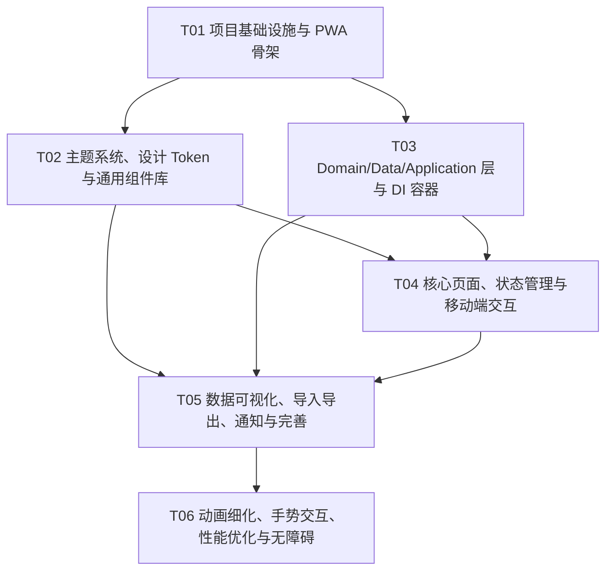

# Commit Web 端开发任务列表

**版本**: 1.0.0  
**创建日期**: 2026-07-05  
**作者**: 架构师 高见远  

---

## 任务总览

| 优先级 | 数量 |
|--------|------|
| **P0** | 3 |
| **P1** | 1 |
| **P2** | 1 |
| **总计** | **5** |

---

## 任务表

| 任务 ID | 任务标题 | 阶段 | 依赖任务 | 文件路径 | 验收标准 | 优先级 |
|---------|----------|------|----------|----------|----------|--------|
| **T01** | 项目基础设施与 PWA 骨架 | 阶段 1 | — | `web/package.json` `web/vite.config.ts` `web/tsconfig.json` `web/tsconfig.app.json` `web/tsconfig.node.json` `web/tailwind.config.ts` `web/index.html` `web/public/manifest.json` `web/public/icons/*` `web/src/main.tsx` `web/src/app.tsx` `web/src/index.css` | 1. `npm install` 成功，无依赖冲突； 2. `npm run dev` 可启动本地服务； 3. `npm run build` 成功输出到 `web/dist/`； 4. `manifest.json` 配置完整（name/short_name/icons/theme-color/display/scope/start_url）； 5. Tailwind CSS 4 与 Vite 集成生效，`index.css` 中 `@import "tailwindcss"` 无报错； 6. 根路由 `/` 可渲染基础页面，无控制台错误。 | P0 |
| **T02** | 主题系统、设计 Token 与通用组件库 | 阶段 1~2 | T01 | `web/src/core/theme/colors.ts` `web/src/core/theme/typography.ts` `web/src/core/theme/dimensions.ts` `web/src/core/theme/theme-provider.tsx` `web/src/core/hooks/use-breakpoint.ts` `web/src/core/hooks/use-is-mobile.ts` `web/src/core/hooks/use-is-desktop.ts` `web/src/core/hooks/use-is-wide.ts` `web/src/presentation/icons/app-icons.tsx` `web/src/presentation/components/common/app-button.tsx` `web/src/presentation/components/common/app-card.tsx` `web/src/presentation/components/common/app-badge.tsx` `web/src/presentation/components/common/app-input.tsx` `web/src/presentation/components/common/app-dialog.tsx` `web/src/presentation/components/common/app-toast.tsx` `web/src/presentation/components/common/app-segmented-control.tsx` `web/src/presentation/components/common/hero-empty-state.tsx` `web/src/presentation/components/common/responsive-builder.tsx` `web/src/presentation/components/common/split-view.tsx` `web/src/presentation/components/layout/app-layout.tsx` `web/src/presentation/components/layout/safe-area.tsx` | 1. CSS Variables 完整映射 `AppThemeColors` 深色/浅色 token，切换 `.dark/.light` class 时颜色即时更新； 2. `themeColor` 动态覆盖 `--color-primary` 系列变量； 3. `useBreakpoint` 正确返回 5 个断点 + `isWide`； 4. `AppLayout` 在 ≥840px 显示 200px 侧边导航（选中 3px primary 色条），<840px 显示 48px 底部导航； 5. `SplitView` 在 ≥1024px 双栏显示，<1024px 仅显示 master； 6. 通用组件（Button/Card/Badge/Input/Dialog/Toast/SegmentedControl/HeroEmptyState）按 DESIGN.md §7 还原视觉； 7. `AppIcon` 支持 36 个图标名映射到 `lucide-react`。 | P0 |
| **T03** | Domain/Data/Application 层与 DI 容器 | 阶段 1~2 | T01 | `web/src/domain/entities/*.ts` `web/src/domain/repositories/i-*.ts` `web/src/domain/services/data-export-service.ts` `web/src/data/db/app-database.ts` `web/src/data/models/*.ts` `web/src/data/repositories/dexie-*.ts` `web/src/application/usecases/repository/*.ts` `web/src/application/usecases/branch/*.ts` `web/src/application/usecases/task/*.ts` `web/src/core/di/injection-container.ts` `web/src/core/utils/validators.ts` `web/src/core/utils/formatters.ts` `web/src/core/extensions/date-extensions.ts` `web/src/core/extensions/string-extensions.ts` | 1. 4 个实体 + 3 个枚举字段与 Flutter 端完全一致，包含 `create` / `copyWith` / `toJson` / `fromValue`； 2. Dexie.js 6 张表 + 索引按架构文档定义创建； 3. 4 个 `Dexie*Repository` 完整实现对应接口，默认过滤 `isDeleted=false`； 4. `CreateRepositoryUseCase` 自动创建 `main` 分支； 5. `CreateTaskUseCase` 创建任务时同步写入 `Commit`（type=create）； 6. `MergeBranchUseCase` 将源分支未完成任务移动到目标分支并记录 merge commit； 7. `DataExportService` 支持 JSON/CSV/Markdown 导出； 8. DI 容器注册所有 Repository/UseCase/Database，Store 中可通过 `container.resolve()` 获取； 9. 数据层单元测试覆盖核心 CRUD。 | P0 |
| **T04** | 核心页面、状态管理与移动端交互 | 阶段 2 | T02, T03 | `web/src/presentation/stores/home-store.ts` `web/src/presentation/stores/repository-store.ts` `web/src/presentation/stores/task-store.ts` `web/src/presentation/stores/search-store.ts` `web/src/presentation/stores/settings-store.ts` `web/src/presentation/screens/home-screen.tsx` `web/src/presentation/screens/repository-screen.tsx` `web/src/presentation/screens/task-detail-screen.tsx` `web/src/presentation/screens/task-form-screen.tsx` `web/src/presentation/screens/search-screen.tsx` `web/src/presentation/screens/settings-screen.tsx` `web/src/presentation/components/repository/*.tsx` `web/src/presentation/components/branch/*.tsx` `web/src/presentation/components/task/*.tsx` `web/src/presentation/components/common/bottom-sheet.tsx` `web/src/presentation/components/common/fab.tsx` `web/src/presentation/components/common/pull-to-refresh.tsx` | 1. 首页可创建/编辑/删除仓库，空状态使用 `HeroEmptyState`； 2. 仓库详情页支持分支切换、创建、合并、删除（main 不可删），任务 CRUD； 3. 任务详情页展示任务字段与提交历史时间线； 4. 搜索页支持按任务/分支/仓库名实时搜索，移动端自动聚焦； 5. 设置页支持 `isDarkMode` 切换、`themeColor` 选择、通知开关、提醒时间、数据导出/导入入口； 6. 各 Store 状态与 Flutter 端 Notifier + State 对齐； 7. 移动端底部操作栏、BottomSheet、FAB、下拉刷新可用； 8. 所有核心页面在 375px ~ 1440px 范围内正常显示，触摸目标 ≥44px。 | P0 |
| **T05** | 数据可视化、导入导出、通知与完善 | 阶段 3~4 | T02, T03, T04 | `web/src/presentation/screens/heatmap-screen.tsx` `web/src/presentation/screens/git-graph-screen.tsx` `web/src/presentation/components/heatmap/heatmap-calendar.tsx` `web/src/presentation/components/heatmap/heatmap-cell.tsx` `web/src/presentation/components/graph/commit-node.tsx` `web/src/presentation/components/graph/branch-edge.tsx` `web/src/application/usecases/import-data-usecase.ts` `web/src/platform/web-file-save-service.ts` `web/src/platform/web-notification-service.ts` | 1. 热力图按日期展示任务完成密度，移动端水平滚动、格子尺寸按断点调整； 2. Git Graph 使用 ReactFlow 展示分支-提交关系，支持节点点击、贝塞尔连线、缩放/平移，移动端默认缩放 0.8x、支持双指缩放； 3. 任务详情页提交历史支持按 CommitType 筛选； 4. 数据导出支持 JSON/CSV/Markdown，JSON 格式与 Flutter 端一致； 5. 数据导入支持 JSON，校验 version 并提示冲突； 6. Web 通知在任务截止前 `reminderHours` 小时触发一次； 7. PWA 可安装，离线可用，iOS/Android 状态栏颜色跟随主题。 | P1 |
| **T06** | 动画细化、手势交互、性能优化与无障碍 | 阶段 5 | T01~T05 | `web/src/index.css`（动画补充） `web/src/core/hooks/use-swipe.ts` `web/src/core/utils/animation-utils.ts` `web/src/presentation/components/common/*`（ARIA 补充） 各 screen 路由懒加载入口 | 1. 页面切换、列表项 hover、主题切换、空状态展示动画符合 DESIGN.md 动画体系（150ms/250ms/350ms，easeOutQuart/easeOutExpo）； 2. 移动端支持下拉刷新、长按操作、左右滑动手势； 3. 路由级懒加载生效，首屏包体积 < 500KB（gzipped）； 4. 虚拟列表在任务列表与提交历史中生效，长列表滚动流畅； 5. 关键组件具备 ARIA 标签与键盘可达性，通过 WCAG 2.1 AA 基础审计； 6. `prefers-reduced-motion` 时禁用非必要动画。 | P2 |

---

## 任务依赖图

---

## 说明

- **P0 任务**为必须完成项，覆盖 PRD 中所有 P0 需求。
- **P1 任务**覆盖 PRD 中热力图、Git Graph、导入导出、Web 通知等 P1 需求。
- **P2 任务**覆盖 PRD 中动画、手势、性能、无障碍等 P2 需求，可在时间允许时进行。
- 每个任务均产出多个文件，按功能模块/层次分组，避免单文件拆分与过长依赖链。
