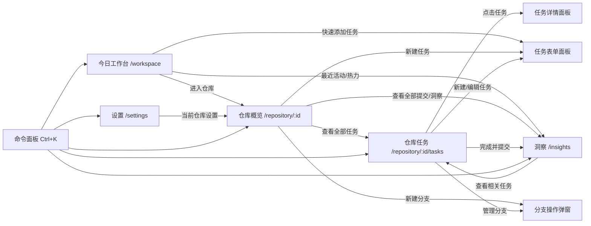

# CommitToDo V3 应用系统改版总览与页面关系

> 文档类型：应用内页面重构总规划 / 页面关系与按钮流向合同  
> 输入资料：`../功能整理与页面清单.md`、`../今日.png`、`../仓库概览.png`、
> `../仓库任务.png`、`../洞察.png`、`../设置.png`  
> 首页资料：`../首页.png`、`../homepage.png` 已阅读，仅作为 V3 品牌视觉基准。
> 因 V3 首页已经实现，本目录不为首页编写实现规划。  
> 目标：别的大模型只阅读本目录文档，即可按截图和功能关系完成 V3 应用内页面。

## 0. 规划边界

V3 应用内系统只保留 5 个主页面：

1. 今日工作台：`/workspace`
2. 仓库概览：`/repository/:id`
3. 仓库任务：`/repository/:id/tasks`
4. 洞察：`/insights`
5. 设置：`/settings`

不再作为桌面一级页面的能力：

- 搜索：桌面端为全局命令面板，移动端可为 `/search` 全屏页。
- 任务详情：桌面端右侧面板，移动端全屏详情。
- 新建/编辑任务：桌面端右侧表单面板，移动端全屏表单。
- 分支新建、合并、归档、删除：弹窗、下拉菜单或右侧面板。
- 提交记录、Graph、Heatmap：统一合并进洞察页的活动、图谱、节奏标签。
- 仓库设置：合并进设置页的“当前仓库”范围。

核心产品关系必须保持：

```text
工作区 -> 仓库 -> 分支 -> 任务 -> 提交
```

## 1. 截图与页面对应关系

| 截图 | 画布 | 对应页面 | 本目录文档 |
| --- | --- | --- | --- |
| `今日.png` | 1536 x 1024 | 今日工作台 | `01-今日工作台.md` |
| `仓库概览.png` | 1672 x 941 | 仓库概览 | `02-仓库概览.md` |
| `仓库任务.png` | 1672 x 941 | 仓库任务 | `03-仓库任务.md` |
| `洞察.png` | 1536 x 1024 | 洞察 | `04-洞察.md` |
| `设置.png` | 1536 x 1024 | 设置 | `05-设置.md` |
| `首页.png` / `homepage.png` | landing | 已实现首页 | 不新增规划 |

首页截图只用于确认以下共性：黑色画布、薄荷绿色主色、克制边框、
Git 分支隐喻、Local-first/PWA/IndexedDB 状态表达。应用页最终还原以
5 张应用截图为准，不以首页布局为准。

## 2. 全局应用壳层

5 个应用页共享同一壳层，除首页外不得出现营销型 hero。

### 2.1 顶部命令栏

暗色截图共同表现：

- 高度：`68-72px`。`今日/洞察/设置` 为 68-72px；`仓库任务` 截图结构线在
  `y=76`，实现可统一为 68px，并让内容区顶部留白补足视觉。
- 背景：`#050807` 到 `#070B0A` 之间，底部 1px 边框 `#1B211F`。
- 左侧品牌区：白色圆角 logo 约 36-40px，右侧 `CommitToDo`，再接 1px
  垂直分隔线。
- 中部：工作区选择器、仓库选择器、搜索/命令面板入口。
- 右侧：新建按钮组、本地保存状态、主题切换、通知、用户菜单。
- 所有图标使用线性图标，推荐 `lucide-react`，16-20px，`strokeWidth=1.5`。

按钮目标：

| 顶栏元素 | 交互目标 |
| --- | --- |
| Logo / CommitToDo | 应用内返回 `/workspace`，不跳 landing 首页 |
| 工作区选择器 | 打开工作区菜单；当前只显示“本地工作区” |
| 仓库选择器 | 打开仓库切换菜单；选择后进入 `/repository/:id` |
| 搜索框 | 打开命令面板；快捷键 `Ctrl+K` / `Command+K` |
| `+ 新建` 主区 | 在仓库上下文中默认新建任务；无仓库时新建仓库 |
| `+ 新建` 下拉 | 新建仓库、新建任务、新建分支、导入数据 |
| 本地已保存 | 打开本地保存状态说明或 toast，不跳转页面 |
| 月亮图标 | 切换深色/浅色/跟随系统，状态写入设置 |
| 通知铃铛 | 打开通知权限/提醒说明；未实现时只显示“即将支持” |
| 用户头像 | 打开账户菜单；入口包括设置、导出、登录 |

### 2.2 左侧一级导航

截图中所有应用页都有固定左侧导航。目标规格：

- 宽度：`220-253px`，按页面截图决定。统一实现建议 `252px`。
- 背景：比主画布稍亮的冷黑，`#070B0A` / `#0B100F`。
- 右边界：1px `#1B211F`。
- 导航项高：44-56px，图标 18-22px，文字 15-18px。
- 选中态：左侧 3-4px 绿色竖条 + 深色选中底 + 绿色图标或文字。
- 下方可出现最近仓库、分区锚点或用户头像，取决于页面。

一级导航目标：

| 导航项 | 目标 |
| --- | --- |
| 今日 | `/workspace` |
| 仓库 / 仓库概览 | 有当前仓库则 `/repository/:id`，否则打开仓库选择 |
| 仓库任务 | `/repository/:id/tasks`，无仓库时提示先选择仓库 |
| 洞察 | `/insights`，仓库上下文可带 `?repository=:id` |
| 设置 | `/settings` |

仓库页左侧导航中“仓库概览”和“仓库任务”需要同时可见。今日页左侧只显示
“今日、仓库、洞察、设置”，并在 RECENT 分区列出最近仓库。

### 2.3 底部状态栏

`今日/仓库任务/洞察/设置` 截图均有底部状态栏，目标统一：

- 高度：`48-61px`，建议实现 `48px`。
- 位置：桌面固定在视口底部，内容不被遮挡。
- 背景：同顶栏，顶部 1px 分隔线。
- 左侧：`IndexedDB · 已保存` 或本地数据库状态。
- 中间：`离线可用`。
- 右侧：`Ctrl+K 命令面板`，附键盘图标。
- 状态圆点/图标必须配文字，不能只靠颜色。

## 3. 页面之间的功能关系



## 4. 目标路由合同

| 路由 | 目标页面/能力 | 备注 |
| --- | --- | --- |
| `/workspace` | 今日工作台 | 应用内默认入口 |
| `/repository/:id` | 仓库概览 | 显示仓库整体进展 |
| `/repository/:id/tasks` | 仓库任务 | 当前分支任务管理 |
| `/insights` | 洞察 | `tab=activity/graph/heatmap` |
| `/settings` | 设置 | `scope=app/workspace/repository` |
| `/search` | 移动端全屏搜索 | 桌面端使用命令面板 |
| `/repository/:id/task/new` | 新建任务 | 桌面右侧表单，移动全屏 |
| `/repository/:id/task/:taskId` | 任务详情 | 桌面右侧详情，移动全屏 |
| `/repository/:id/task/:taskId/edit` | 编辑任务 | 桌面右侧表单，移动全屏 |

兼容旧路由：

- `/repository/:id/commits` 迁移到
  `/insights?repository=:id&tab=activity`。
- `/repository/:id/graph` 迁移到
  `/insights?repository=:id&tab=graph`。
- `/repository/:id/heatmap` 迁移到
  `/insights?repository=:id&tab=heatmap`。
- `/repository/:id/settings` 迁移到
  `/settings?scope=repository&repository=:id`。
- `/repository/:id/search` 迁移到命令面板或移动端 `/search?repository=:id`。

## 5. 全局数据与状态

所有页面共享以下上下文：

- 当前工作区：默认 `本地工作区`。
- 当前仓库：可为空；仓库页必须有值。
- 当前分支：默认仓库主分支 `main`。
- 搜索查询：命令面板临时状态，不污染页面筛选。
- 保存状态：`saved / saving / offline / error`。
- 主题设置：`dark / light / system`，应用页截图以 dark 为基准。
- 面板状态：任务详情、任务表单、分支弹窗、命令面板。

必须覆盖的状态：

- 首次进入应用。
- 没有仓库。
- 仓库没有分支或任务。
- 当前分支没有任务。
- 今日没有任务。
- 搜索无结果。
- 数据加载失败和重试。
- 离线可用。
- 本地保存成功、保存中、保存失败。
- 任务完成、撤销、恢复。
- 完成并提交成功、失败。
- 分支合并确认、失败。
- 导入导出成功、失败。
- PWA 可安装、已安装、不支持。

## 6. 视觉基准

深色应用页主视觉不是首页纯黑营销页，而是冷黑生产工具：

| Token 语义 | 推荐值 | 用途 |
| --- | --- | --- |
| `--color-bg-canvas` | `#070B0A` | 应用背景 |
| `--color-bg-sidebar` | `#0B100F` | 左侧导航 |
| `--color-bg-surface` | `#0D1210` | 卡片、表格、面板 |
| `--color-bg-raised` | `#121816` | 下拉、详情面板 |
| `--color-border` | `#29302D` | 常规边框 |
| `--color-border-subtle` | `#1B211F` | 分隔线 |
| `--color-primary` | `#92D970` | 主按钮、选中、成功 |
| `--color-primary-homepage` | `#80E48C` | 只用于首页或特别强调 |
| `--color-launch` | `#4CCAD4` | launch 分支 |
| `--color-design` | `#718CFF` | design 分支 |
| `--color-warning` | `#F2AD45` | 中优先级、警告 |
| `--color-danger` | `#F0645A` | 高优先级、危险 |

圆角规则：

- 面板和卡片：8px。
- 按钮、输入、chip：6px。
- 小色块/热力图：2-4px。
- 禁止把应用页做成大圆角玻璃卡片。

## 7. 跨页面按钮流向矩阵

| 可见按钮/入口 | 所在页面 | 目标行为 |
| --- | --- | --- |
| 快速添加任务 | 今日 | 打开任务表单面板；默认最近仓库和分支 |
| 新建仓库 | 今日 / 顶栏下拉 | 打开新建仓库弹窗 |
| 进入仓库/最近仓库卡 | 今日 | `/repository/:id` |
| 任务行 | 今日 / 概览 / 任务 | 桌面打开任务详情面板 |
| 任务复选框 | 今日 / 任务 | 快速完成或恢复任务 |
| 显示已完成的任务 | 今日 | 展开/折叠已完成任务列表 |
| 查看完整洞察 | 今日 / 概览 / 右栏 | `/insights?tab=heatmap` 或带仓库参数 |
| 查看全部仓库 | 今日 | 打开仓库选择或滚动到最近仓库列表 |
| 新建分支 | 概览 / 任务 | 打开分支弹窗 |
| 查看全部分支 | 概览 | 打开分支管理弹窗或任务页分支面板 |
| 查看全部任务 | 概览 | `/repository/:id/tasks` |
| 查看全部提交 | 概览 | `/insights?repository=:id&tab=activity` |
| 管理分支 | 任务 | 打开分支操作菜单 |
| 编辑任务 | 任务详情 | `/repository/:id/task/:taskId/edit` 面板态 |
| 恢复任务 | 任务详情 | 更新状态为待办并保留历史提交 |
| 删除任务 | 任务详情 | 二次确认后软删除 |
| 查看相关任务 | 洞察 | `/repository/:id/tasks?commit=:hash` |
| 复制哈希 | 洞察 | 写入剪贴板并 toast |
| 安装 CommitToDo | 设置 | 调用 PWA install prompt |
| 登录 | 设置 / 用户菜单 | 打开登录流程；本地模式保持可用 |
| 导出 JSON/CSV/Markdown | 设置 | 调用导出服务并 toast |
| 导入数据 | 设置 | 打开文件选择，校验后导入 |
| 归档仓库 | 设置 | 二次确认，仓库从默认列表隐藏 |
| 删除仓库 | 设置 | 强确认，删除仓库及子数据 |

## 8. 实现顺序建议

1. 先改造全局壳层：顶栏、左侧导航、底部状态栏、命令面板入口。
2. 实现 `/repository/:id` 与 `/repository/:id/tasks` 的拆分路由。
3. 完成今日工作台，因为它是应用入口和空状态核心。
4. 完成仓库概览，再完成仓库任务。
5. 把提交记录、Graph、Heatmap 合并为洞察页。
6. 把全局设置和仓库设置合并为设置页。
7. 补齐任务详情、任务表单、分支弹窗、命令面板的面板态。

## 9. 验收方式

每个页面都必须在对应截图尺寸下截图对比：

| 页面 | 视口 |
| --- | --- |
| 今日工作台 | 1536 x 1024 |
| 仓库概览 | 1672 x 941 |
| 仓库任务 | 1672 x 941 |
| 洞察 | 1536 x 1024 |
| 设置 | 1536 x 1024 |

验收标准：

- 顶栏、左栏、右栏、底栏结构线误差不超过 2px。
- 主标题、主按钮、主要面板位置误差不超过 4px。
- 非动态区域主色和背景单通道平均误差不超过 8。
- 文案、按钮、列表分组和状态 chip 与文档一致。
- 所有截图中的按钮都能点击并产生文档指定行为。
- 所有筛选、排序、面板、弹窗、导出导入、完成/恢复动作有测试覆盖。
